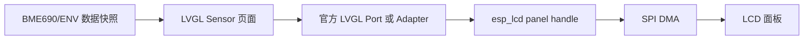

# ESPC51 / ESPC52 LCD + LVGL 移植最终任务书

## 0. 最终任务

以现有 LCD 组件目录：

```text
D:\ESPproject\board_bme690\components\lcd
```

作为唯一移植基线，将该 LCD 功能分别移植到 ESPC51 和 ESPC52 固件中。

建议目标目录为：

```text
D:\ESPproject\ESPC51\components\lcd
D:\ESPproject\ESPC52\components\lcd
```

若实际仓库根目录不同，以 Codex 审计得到的真实路径为准，不得凭空新建错误仓库结构。

本任务还包括 LVGL 接入。LVGL、LCD panel、触摸等通用能力必须优先查找并使用 ESP-IDF、Espressif Component Registry 或 LVGL 官方组件，不允许在已有官方实现可用时从零重写完整框架。

最终目标：

1. 保留 `board_bme690` 中现有 LCD 的显示效果、初始化参数和接口行为；
2. 在 ESPC51、ESPC52 中形成一致的 LCD 组件；
3. 使用官方 LVGL 及官方 ESP-IDF 适配组件建立 GUI 运行路径；
4. 严格控制内部 RAM、DMA RAM、PSRAM、任务栈、SPI 带宽和 CPU 占用；
5. 不破坏 C5 已有语音、BME690、CSI、Wi-Fi、网络上传和设备在线链路；
6. ESPC51、ESPC52 保持功能和代码结构一致，仅允许存在经过说明的板级引脚差异；
7. 不修改 ESP-server，不启动 ESP-server，不修改服务器前端。

---

## 1. 最高优先级约束

### 1.1 原始 LCD 目录只读

以下目录是移植源，不是直接开发目录：

```text
D:\ESPproject\board_bme690\components\lcd
```

硬性要求：

- 不修改其中任何现有文件；
- 不在其中执行格式化；
- 不删除、重命名或移动文件；
- 不改变其构建配置；
- 不直接加入 ESPC51 或 ESPC52 的板级特例；
- 移植前生成完整文件清单和 SHA-256；
- 任务结束时重新校验，保证源目录完全未变化。

必须先复制，再在目标工程的新组件目录中完成适配。

### 1.2 ESPC51 / ESPC52 现有业务代码保护

现有语音、CSI、BME690、网络、设备状态和资源仲裁代码不得为 LCD 移植而重写或改变业务行为。

默认允许新增：

- 新的 `components/lcd`；
- 新的 LCD/LVGL 适配文件；
- 新的只读审计报告；
- 新的组件清单；
- 官方组件依赖声明；
- 新的测试文件；
- 新的资源诊断文件。

不允许：

- 重构语音链路；
- 改变 Mic、Speaker、I2S、DMA 分配方式；
- 改变 BME690 采样周期；
- 改变 CSI 回调、特征计算或上传；
- 改变 Wi-Fi、S3 网关、心跳、状态上报；
- 修改 ESP-server；
- 启动本地 ESP-server；
- 为 LCD 提高其他关键任务的阻塞时间；
- 用全屏 framebuffer 抢占大块内部 RAM。

### 1.3 “现有代码不改”的执行边界

本任务优先通过以下方式接入：

1. 将源 LCD 目录原样复制为目标工程中的新组件；
2. 使用目标工程已有的组件自动发现机制；
3. 使用目标工程已有的启动钩子、服务注册器或 UI 扩展点；
4. 将板级差异放入新建配置文件或新建 wrapper；
5. 将官方依赖写入新组件自己的 `idf_component.yml`；
6. 不修改已有业务模块。

如果目标工程不存在任何可用的初始化入口，无法在不修改现有启动代码的情况下调用 LCD/LVGL 初始化，则必须停止自动接入，并在报告中明确给出：

```text
阻塞：缺少已有启动扩展点。
继续实施至少需要在现有启动链路中增加一次 lcd_service_start() 调用。
本轮不得自动修改。
```

禁止使用 constructor、符号覆盖、链接劫持、同名函数替换或后台自启动技巧绕过该限制。

---

## 2. 官方组件优先级

任何新依赖都必须先搜索以下来源：

1. ESP-IDF 内置组件；
2. Espressif Component Registry；
3. Espressif 官方 GitHub 仓库；
4. LVGL 官方组件；
5. LCD/触摸芯片厂商官方驱动；
6. 只有前述来源均不存在兼容实现时，才允许评估第三方组件。

禁止先复制网络博客、论坛或个人仓库中的完整 LVGL/LCD 框架。

### 2.1 LCD 底层

优先使用 ESP-IDF 官方 `esp_lcd`。

若屏幕控制器是 ST7789，优先使用 ESP-IDF 自带的 ST7789 panel 驱动，不重新实现整套 SPI 命令和 panel 抽象。

仅当源 LCD 组件包含该屏幕必须的厂商初始化序列时，才保留：

- gamma；
- inversion；
- porch；
- power；
- MADCTL；
- color order；
- offset；
- rotation；
- backlight 时序。

这些扩展命令应建立在官方 `esp_lcd` panel/IO 之上，而不是替换官方底层。

### 2.2 LVGL 默认选择

默认优先组合：

```text
lvgl/lvgl
espressif/esp_lvgl_port
```

理由：

- 均可通过 ESP Component Registry 管理；
- `esp_lvgl_port` 已负责 LVGL 初始化、任务、timer、`esp_lcd` display 注册、旋转和输入设备适配；
- 可避免自行编写 LVGL tick、flush task、display glue 和线程同步框架；
- 更适合当前 SPI LCD 的最小接入。

### 2.3 `esp_lvgl_adapter` 选择条件

只有两端 ESP-IDF 均满足其最低版本，并且确实需要以下能力时，才评估：

```text
espressif/esp_lvgl_adapter
```

适用场景：

- 统一 display 管理；
- 更完整的线程安全访问；
- 复杂防撕裂策略；
- 多显示器；
- 文件系统、图片解码或 FreeType；
- adapter 提供的 bitmap/touch 外部适配 hook。

对于 ESPC51/ESPC52 当前资源紧张、SPI 小屏和简单 Sensor 页面，默认不启用其可选图片解码、文件系统、FreeType、FPS、Dummy Draw、多屏等功能。

### 2.4 版本选择原则

不得无条件使用 `*` 或永远追随最新版。

先分别记录：

```text
idf.py --version
git describe --tags --always
目标芯片
编译器版本
现有 managed_components
现有 dependencies.lock
```

然后：

1. 以 ESPC51 和 ESPC52 中较低的 ESP-IDF 版本作为共同兼容基线；
2. 不在本任务中升级 ESP-IDF；
3. 选择同时兼容两端的同一 LVGL major 版本；
4. 选择同时兼容两端的同一 Espressif LVGL port/adapter 版本；
5. 初次验证可以使用兼容范围；
6. 双端构建和真机稳定后，固定到精确版本；
7. ESPC51 与 ESPC52 的依赖版本必须一致；
8. 保存并提交生成的依赖锁定结果。

推荐决策：

```text
ESP-IDF >= 5.5：
    优先评估 esp_lvgl_port；
    只有需要 adapter 高级能力时才选 esp_lvgl_adapter。

ESP-IDF >= 5.2 且 < 5.5：
    使用 esp_lvgl_port；
    不使用要求更高 IDF 的 adapter。

ESP-IDF < 5.2：
    查找与该 IDF 兼容的官方 esp_lvgl_port 历史稳定版本；
    不升级 IDF，不自行重写 port。
```

---

## 3. 第一阶段：只读审计

在复制或下载组件前，先审计三个工程。

### 3.1 源 LCD 审计

审计：

```text
D:\ESPproject\board_bme690\components\lcd
```

必须确认：

- 文件清单；
- 公开头文件；
- `CMakeLists.txt`；
- `Kconfig`；
- `idf_component.yml`；
- LCD 控制器型号；
- 分辨率；
- SPI host；
- SPI 时钟；
- MOSI、SCLK、CS、DC、RST、BL 引脚；
- 是否使用 MISO；
- 颜色格式；
- RGB/BGR；
- RGB565 字节序；
- X/Y offset；
- 屏幕旋转；
- panel 初始化序列；
- 背光有效电平；
- `esp_lcd_panel_draw_bitmap()` 的调用方式；
- flush 完成回调；
- DMA buffer；
- mutex/semaphore；
- 任务和定时器；
- bitmap 字体；
- 是否已有 LVGL；
- 是否已有触摸；
- 是否包含临时测试代码；
- 是否硬编码板级引脚；
- 是否依赖 `board_bme690` 其他组件。

输出：

```text
reports/lcd_source_audit.md
reports/lcd_source_manifest.sha256
```

### 3.2 ESPC51 / ESPC52 审计

分别确认：

- 仓库根目录；
- ESP-IDF 版本；
- 芯片 target 是否确实为 ESP32-C5；
- flash 大小；
- 是否存在 PSRAM及可用容量；
- SPI host 使用情况；
- LCD 引脚是否与源板一致；
- 是否与 BME690、Mic、Speaker、I2S、CSI、Wi-Fi 或其他外设冲突；
- 已有组件名称是否与 `lcd` 冲突；
- 是否已有 LVGL；
- 是否已有 `esp_lcd`；
- 是否已有触摸；
- 是否已有 UI 任务；
- 是否已有统一资源仲裁器；
- 是否有启动服务注册接口；
- 当前任务优先级和栈；
- 当前内部 RAM、DMA RAM、PSRAM 基线；
- 当前最小 heap；
- 语音唤醒、录音、等待响应、播放阶段的最差资源值；
- 是否已有 `sdkconfig` 中的 LVGL 配置；
- 当前 `idf_component.yml` 和 `dependencies.lock` 状态。

输出：

```text
ESPC51/reports/lcd_target_audit.md
ESPC52/reports/lcd_target_audit.md
reports/c51_c52_lcd_migration_matrix.md
```

### 3.3 引脚冲突门禁

任何 LCD 引脚与以下资源冲突都必须停止：

- BME690 I2C/SPI；
- 麦克风 ADC/I2S；
- Speaker I2S；
- Flash/PSRAM；
- CSI/Wi-Fi 保留功能；
- USB/JTAG；
- 启动 strapping pin；
- 已占用中断引脚；
- 触摸控制器；
- 板载状态灯或电源控制。

不得通过“先占用再看能不能工作”的方式验证。

---

## 4. 第二阶段：建立双端一致的组件结构

### 4.1 首次复制

从源目录分别复制到：

```text
D:\ESPproject\ESPC51\components\lcd
D:\ESPproject\ESPC52\components\lcd
```

首次复制必须保持：

- 文件内容一致；
- 目录层级一致；
- 文件名一致；
- API 一致；
- 初始化序列一致；
- 字库和图片资源一致。

复制后生成：

```text
ESPC51/reports/lcd_copy_manifest.sha256
ESPC52/reports/lcd_copy_manifest.sha256
```

并校验两端组件 hash 一致。

### 4.2 板级差异隔离

若 C51 和 C52 引脚相同：

- 使用完全相同组件；
- 不创建两套分叉实现。

若引脚不同：

- 仅允许新建独立板级配置；
- 核心 LCD 驱动保持一致；
- API 保持一致；
- 不在核心函数中加入大量 `#ifdef ESPC51/ESPC52`。

推荐结构：

```text
components/lcd/
├── CMakeLists.txt
├── idf_component.yml
├── include/
│   ├── lcd.h
│   ├── lcd_board_config.h
│   └── lcd_resource_diag.h
├── lcd.c
├── lcd_board_config.c
├── lcd_resource_diag.c
└── ui/
    ├── lcd_ui.c
    └── lcd_ui.h
```

如果源组件已经有成熟结构，优先保留源结构，不为“看起来整齐”而重构。

### 4.3 禁止分叉

ESPC51、ESPC52 目标组件只有以下差异可以接受：

- GPIO；
- SPI host；
- 背光有效电平；
- 屏幕 offset；
- 物理旋转；
- 触摸校准值；
- 由硬件差异造成的 SPI 上限。

每项差异必须记录原因。

---

## 5. 第三阶段：官方依赖接入

### 5.1 依赖清单

按实际硬件选择：

```yaml
dependencies:
  lvgl/lvgl:
    version: "<审计后固定版本>"
    public: true

  espressif/esp_lvgl_port:
    version: "<审计后固定版本>"
```

若最终选择 adapter，则二选一，不得同时启用两个 LVGL 管理层：

```yaml
dependencies:
  lvgl/lvgl:
    version: "<审计后固定版本>"
    public: true

  espressif/esp_lvgl_adapter:
    version: "<审计后固定版本>"
```

禁止：

- 同时初始化 `esp_lvgl_port` 和 `esp_lvgl_adapter`；
- 同时创建两套 LVGL task/timer；
- 同时注册同一 panel 两次；
- 手工复制完整 LVGL 源码到项目；
- 从个人仓库下载未知修改版 LVGL；
- 在 C51、C52 使用不同 major 版本。

### 5.2 下载方式

优先使用组件清单和 ESP-IDF Component Manager。

允许：

```text
在新组件的 idf_component.yml 中声明官方依赖；
由 idf.py build 下载到 managed_components；
生成或更新依赖锁。
```

不允许：

- 把 `managed_components` 中下载后的源码手工修改；
- 把缓存目录当成正式源码；
- 删除 lock 后让每次构建随机选版本；
- 下载后不检查许可证、版本和 target 兼容性。

### 5.3 官方 LCD / Touch 组件

按以下顺序：

1. ESP-IDF 内置 `esp_lcd`；
2. ESP-IDF 内置 ST7789 panel；
3. Espressif 官方 `esp_lcd_touch`；
4. 具体触摸控制器的 Espressif 官方组件；
5. 无官方组件时才保留源项目中的最小厂商适配。

---

## 6. LCD 与 LVGL 运行架构

推荐单一显示链路：



硬性要求：

- panel 只初始化一次；
- SPI device 只创建一次；
- LVGL display 只注册一次；
- 同一 LCD 不允许传统绘制任务和 LVGL task 并发提交；
- 不创建第二套 panel handle；
- 不创建第二套 SPI bus；
- 不建立一个只被新模块使用、无法约束旧代码的“假互斥锁”；
- bitmap 绘制最终统一经过同一 display/panel 所有权路径；
- flush 完成后才能复用 draw buffer；
- `lvgl_port_lock()` / adapter lock 必须覆盖所有跨任务 LVGL 对象访问。

---

## 7. 资源分配最终方案

ESPC51/ESPC52 同时承担语音、CSI、BME、Wi-Fi 和网络任务，LCD/LVGL 必须作为低优先级 UI 能力接入。

## 7.1 任务模型

默认只允许官方 LVGL 组件创建一套运行资源：

| 项目 | 上限 |
| --- | ---: |
| LVGL task | 1 |
| LVGL tick timer | 1 |
| LCD SPI panel | 1 |
| display | 1 |
| draw buffer | 默认 1 |
| LCD 专用业务队列 | 0，除非官方组件内部需要 |
| 自定义 LCD 后台任务 | 0 |
| 自定义 bitmap worker | 0 |

禁止再自行创建：

- `lcd_task`；
- `bitmap_task`；
- 第二个 GUI task；
- 第二个 LVGL timer；
- 60 FPS 固定刷新任务。

### 7.2 任务优先级

LVGL task 优先级必须：

- 低于 Mic/录音任务；
- 低于 Speaker/I2S 写入任务；
- 低于语音响应接收关键任务；
- 低于网络恢复关键 worker；
- 不高于 BME/CSI 常规 worker，除非实测触摸无法使用；
- 不得导致语音阶段 watchdog 或音频断流。

具体数值必须根据两端已有任务表决定，不在计划中盲目写死。

### 7.3 栈

初始建议：

```text
LVGL task stack：4096 bytes 起步
允许上调到：6144 bytes
超过 6144 bytes：必须提供 high-water 证据
```

要求：

- 运行 30 分钟后剩余栈不少于 1024 bytes；
- 页面切换、文本刷新和触摸期间不得低于 768 bytes；
- 不启用大型 demo、FreeType 或复杂图片解码；
- 若官方组件支持把 task stack 放入 PSRAM，只有目标硬件确有 PSRAM且稳定时才评估；
- ISR、DMA 描述符和关键同步对象仍必须留在内部 RAM。

### 7.4 LVGL draw buffer

禁止全屏 framebuffer。

默认使用 RGB565、局部刷新、单 buffer：

```text
buffer_pixels = horizontal_resolution × strip_lines
buffer_bytes  = buffer_pixels × 2
```

起始值：

```text
strip_lines = 8
```

示例：

| 分辨率宽度 | 8 行 RGB565 | 16 行 RGB565 |
| ---: | ---: | ---: |
| 240 px | 3840 bytes | 7680 bytes |
| 320 px | 5120 bytes | 10240 bytes |

执行原则：

1. 先使用 8 行；
2. 只在 flush 次数过多或显示明显异常时测试 16 行；
3. 默认单 buffer；
4. 只有单 buffer 实测不能满足且 DMA 资源充足时才测试双 buffer；
5. 单 buffer 不超过 12 KiB；
6. 双 buffer 合计不超过 24 KiB；
7. buffer 初始化时一次性分配；
8. 刷新热路径禁止 malloc/free；
9. SPI DMA buffer 优先使用 DMA-capable internal RAM；
10. 未经验证不得直接把 PSRAM 指针交给 SPI DMA。

### 7.5 LVGL 内存

初始总预算：

| 资源 | 建议值 | 硬上限 |
| --- | ---: | ---: |
| LVGL 核心/对象动态内存 | 24 KiB | 40 KiB |
| draw buffer | 4–6 KiB | 12 KiB |
| 双 buffer | 默认关闭 | 24 KiB 合计 |
| 字体常量 | Flash | 8 KiB |
| 页面对象 | 4 个 label + 容器 | 8 KiB |
| 图片资源 | 默认 0 | 按报告审批 |
| 新 DMA staging | 默认 0 | 4 KiB |

关闭：

- LVGL demos；
- benchmark；
- 大型主题；
- 阴影；
- 渐变；
- 复杂动画；
- 图片解码；
- FreeType；
- 多语言大字库；
- 文件系统桥；
- 多屏；
- 多绘制线程；
- 软件旋转，除非硬件旋转不可用；
- 不使用的 widgets。

### 7.6 PSRAM

先检测 C51、C52 是否真的配置并启用了 PSRAM。

有 PSRAM时：

适合放入 PSRAM：

- 非 DMA 图片；
- 非关键 UI 缓存；
- 大型冷数据；
- 官方组件明确支持的 LVGL task stack；
- 非实时字体缓存。

不得直接假设放入 PSRAM：

- SPI DMA buffer；
- I2S DMA buffer；
- ISR 数据；
- panel IO 描述符；
- 必须低延迟访问的锁和控制结构。

没有 PSRAM时：

- 使用单 partial draw buffer；
- 不启用图片；
- 不启用复杂字体；
- 不启用双 buffer；
- 不提高刷新率；
- UI 只保留 Sensor 数据、状态文字和必要按钮。

### 7.7 内部 RAM 与 DMA 门禁

先记录未接入时完整语音周期的最差值，再比较接入后数据。

必须记录：

```text
heap_caps_get_free_size(MALLOC_CAP_INTERNAL)
heap_caps_get_largest_free_block(MALLOC_CAP_INTERNAL)
heap_caps_get_free_size(MALLOC_CAP_DMA)
heap_caps_get_largest_free_block(MALLOC_CAP_DMA)
heap_caps_get_minimum_free_size(MALLOC_CAP_INTERNAL)
PSRAM free/largest
LVGL task high-water
```

阶段：

- 启动前；
- LCD init 前后；
- LVGL init 前后；
- UI 创建后；
- 空闲 10 分钟；
- 唤醒词检测；
- 唤醒提示播放；
- Mic 录音；
- 等待服务器；
- PCM 播放；
- BME + CSI + 网络同时运行；
- 页面连续刷新；
- 运行 24 小时。

硬性门禁：

1. 不出现 `ESP_ERR_NO_MEM`；
2. 不出现 I2S DMA 分配失败；
3. 不出现 Speaker writer 创建失败；
4. 不出现 Mic DMA 创建失败；
5. 不出现 LCD DMA 提交失败；
6. 接入后 internal free 的固定下降默认不超过 32 KiB；
7. 接入后 DMA free 的固定下降默认不超过 8 KiB；
8. internal largest block 不得下降超过基线的 25%；
9. DMA largest block 必须仍能满足现有 I2S 最大单次申请和 LCD 最大传输块；
10. 语音播放期间 UI 可暂停或降频，不能争抢关键 DMA；
11. 任一门禁失败，先减 buffer/功能，不得增加其他模块风险。

### 7.8 刷新策略

Sensor 页面不需要高帧率。

要求：

- 数据变化时刷新；
- 或沿用现有低频刷新周期；
- 建议数值刷新 1 Hz；
- 无变化不重复 invalidate；
- 语音独占期间暂停动画；
- 语音独占期间 Sensor 数值最多低频刷新或完全暂停；
- 不进行全屏周期刷新；
- 页面首次进入允许完整绘制，后续只更新变化区域；
- 字符串变短时正确清除旧区域；
- 不在 BME 采样锁内部调用 LVGL；
- 先复制 ENV 快照，再释放锁，再更新 UI。

若现有资源仲裁器已经提供 `VOICE_EXCLUSIVE`/`voice_busy` 事件，应使用已有事件控制 LVGL sleep/pause；如果没有公开事件入口，不允许修改语音核心代码强行加入。

---

## 8. Bitmap 功能处理

源 LCD 中已有 bitmap 能力时：

- 保留原实现；
- 检查是否最终调用官方 `esp_lcd_panel_draw_bitmap()`；
- 检查颜色字节序；
- 检查边界；
- 检查 DMA 完成；
- 检查 buffer 生命周期；
- 不重复实现第二套 bitmap API。

LVGL 接入后优先：

- 普通文本使用 LVGL label；
- 固定小图标可使用 LVGL image/canvas，但默认关闭图片解码器；
- 必须直接绘制原始 RGB565 bitmap 时，复用 panel 所有权路径；
- 不允许 LVGL flush 与手工 `lcd_draw_bitmap()` 并发。

若需要保留传统 API，必须提供统一串行规则：

```text
仅在 LVGL 未运行或 display 已暂停时使用传统 API；
LVGL 运行后，业务页面统一经 LVGL 绘制。
```

---

## 9. 触摸接入

若源板有触摸：

1. 确认控制器型号；
2. 优先搜索 Espressif 官方 `esp_lcd_touch` 及对应控制器组件；
3. 复用官方 LVGL port/adapter 的 touch 注册接口；
4. 不自行编写完整 LVGL indev 框架；
5. 触摸分辨率不同则使用官方 scale 配置；
6. 旋转和镜像必须同时校准显示和触摸；
7. 触摸 I2C/SPI 不得与 BME690 冲突；
8. 触摸中断不得使用已占用 GPIO；
9. 触摸扫描不得阻塞语音任务。

无触摸硬件时，不下载触摸组件，不创建空 touch task。

---

## 10. 双端实施顺序

### P0：基线

分别在 ESPC51 和 ESPC52：

- 保存 `git status`；
- 记录未提交改动；
- 构建现有固件；
- 保存固件大小；
- 保存 map 文件；
- 保存任务表；
- 保存 heap/DMA/PSRAM 基线；
- 验证语音、BME、CSI、网络现状。

基线失败则停止，不把既有失败归因于 LCD。

### P1：源组件复制

- 只读复制 LCD 组件；
- 校验 hash；
- 不接 LVGL；
- 不初始化显示；
- 先确认组件能被构建系统识别；
- 解决纯编译依赖，但不得改变已有业务行为。

### P2：LCD 独立点亮

通过已有启动扩展点启动：

- panel reset；
- panel init；
- rotation/mirror；
- backlight；
- 色块；
- RGB565 bitmap；
- 边界；
- 多分块；
- flush 完成。

先在 ESPC51 验证，再把完全相同修订同步到 ESPC52。

禁止两端独立随意修改。

### P3：官方 LVGL 接入

- 确认共同 IDF 版本范围；
- 选择官方 port 或 adapter；
- 声明固定依赖；
- 禁用不需要的功能；
- 单 partial buffer；
- 创建最小页面；
- 只显示四行 Sensor 数据和必要状态；
- 验证 LVGL lock；
- 验证 panel 单一所有权。

### P4：C51 资源验证

在 ESPC51 完整验证：

- BME；
- CSI；
- Wi-Fi/S3；
- 心跳/状态；
- 唤醒；
- 提示音；
- 录音；
- 等待响应；
- PCM 播放；
- LCD 连续刷新；
- 触摸；
- 24 小时运行。

资源门禁全部通过后才能进入 C52。

### P5：C52 同步验证

- 同步同一 LCD/LVGL 组件；
- 只应用已记录的板级配置差异；
- 重新构建；
- 执行与 C51 相同测试；
- 对比固件大小、heap、DMA、栈、刷新耗时；
- 两端结果必须在合理误差范围内。

### P6：双端一致性

最终检查：

```text
核心 lcd 源码 hash 一致；
LVGL 版本一致；
esp_lvgl_port/adapter 版本一致；
Kconfig 选项一致；
buffer 配置一致；
UI 对象结构一致；
公开 API 一致；
仅板级配置允许不同。
```

---

## 11. 构建和验证要求

### 11.1 构建

分别执行：

```text
ESPC51：只构建 ESPC51 固件
ESPC52：只构建 ESPC52 固件
```

不执行：

- ESP-server 启动；
- ESP-server 部署；
- 服务器数据库操作；
- 前端构建；
- 火山网关 canary；
- 与 LCD 无关的仓库重构。

### 11.2 编译门禁

必须通过：

- clean build；
- incremental build；
- `git diff --check`；
- 无重复 symbol；
- 无弃用 API 警告，或明确记录；
- 无 LVGL major API 混用；
- 无组件版本漂移；
- 无 target 错误；
- 无未使用的大型 demo 组件；
- map 文件中无意外全屏 framebuffer。

### 11.3 真机显示

验证：

- 开机初始化；
- 纯红、绿、蓝、白、黑；
- RGB/BGR；
- RGB565 byte swap；
- 旋转；
- offset；
- 文本；
- bitmap；
- 数值变长、变短；
- 局部刷新；
- 页面切换；
- 连续刷新；
- 背光；
- 睡眠/唤醒；
- 无花屏；
- 无撕裂；
- 无错位；
- 无残留；
- 无 watchdog。

### 11.4 业务回归

必须确认：

- BME690 数据正确；
- ENV 快照读取正常；
- CSI 数据正常；
- C5 到 S3 注册正常；
- heartbeat/status 正常；
- Wi-Fi 重连正常；
- 语音唤醒正常；
- 提示音正常；
- Mic 录音窗口正常；
- 人说完后再关闭 Mic；
- 服务器响应正常；
- PCM 播放正常；
- 无 I2S DMA 失败；
- 无 heap alloc 失败；
- LCD 不导致 C5 离线；
- 语音期间 LCD 不抢占关键资源。

---

## 12. 停止条件

出现任一情况立即停止：

- 源 LCD 目录发生变化；
- C51/C52 LCD GPIO 与关键外设冲突；
- 目标 IDF 不支持所选官方组件；
- 只能通过升级 IDF 才能继续；
- 只能从零重写 LVGL port；
- 只能修改 managed component 源码；
- 需要同时运行两套 LVGL 管理层；
- 需要重复初始化 panel/SPI；
- 需要全屏 framebuffer；
- 需要在刷新热路径动态分配；
- 需要修改语音、CSI、BME 或网络核心逻辑；
- 没有公开启动扩展点；
- 需要 constructor、hook 或符号劫持；
- DMA largest block 不满足语音和显示共同需求；
- 新增 LCD 后出现音频断流；
- 新增 LCD 后出现设备离线；
- 新增 LCD 后出现 watchdog；
- C51 与 C52 核心代码发生无理由分叉。

---

## 13. 最终交付物

必须交付：

1. 源 LCD 只读审计报告；
2. 源 LCD SHA-256 清单；
3. C51/C52 硬件和引脚差异表；
4. C51 `components/lcd`；
5. C52 `components/lcd`；
6. 官方 LVGL 依赖清单；
7. 固定版本和 lock 结果；
8. LCD/LVGL 资源配置说明；
9. 固件大小对比；
10. internal/DMA/PSRAM 对比；
11. 任务栈 high-water 报告；
12. C51 真机验证报告；
13. C52 真机验证报告；
14. 双端一致性报告；
15. 未解决阻塞项；
16. 完整回退说明。

回退要求：

- 删除新增 LCD/LVGL 组件及依赖声明即可回退；
- 原始 `board_bme690` LCD 目录不需要恢复，因为从未修改；
- 不留下后台任务、临时测试调用、下载脚本或未固定依赖。

---

## 14. 最终验收标准

只有以下全部满足才算完成：

- LCD 已从指定源目录移植到 ESPC51；
- LCD 已从指定源目录移植到 ESPC52；
- 原始 LCD 目录一个文件都没改；
- 两端核心 LCD 组件保持一致；
- LVGL 使用官方组件；
- LCD panel 优先使用官方 `esp_lcd`；
- 没有从零重写 LVGL port；
- 没有两套 display 所有权；
- 没有全屏 framebuffer；
- 资源分配符合预算；
- 语音阶段无内存和 DMA 失败；
- BME/CSI/网络链路不受影响；
- C51/C52 编译通过；
- C51/C52 真机通过；
- 无 watchdog；
- 无设备离线回归；
- 无 ESP-server 修改；
- 无 ESP-server 本地启动；
- 所有依赖版本已固定；
- 所有板级差异有明确说明。

---

## 15. 官方组件选择结论

本任务不得默认“自己写一个 LVGL 适配层”。

默认路线：

```text
现有 LCD 组件
    ↓
ESP-IDF 官方 esp_lcd / ST7789 panel
    ↓
Espressif 官方 esp_lvgl_port
    ↓
LVGL 官方 lvgl/lvgl
    ↓
最小 Sensor UI
```

当两端 ESP-IDF 均满足要求且确有高级显示管理需求时，才将：

```text
esp_lvgl_port
```

替换为：

```text
esp_lvgl_adapter
```

两者不得同时使用。

> 核心原则：复制并复用现有 LCD，优先下载官方组件，最小化自定义适配，先保护语音和 DMA 资源，再追求显示效果。
