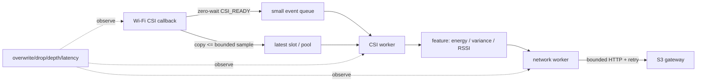
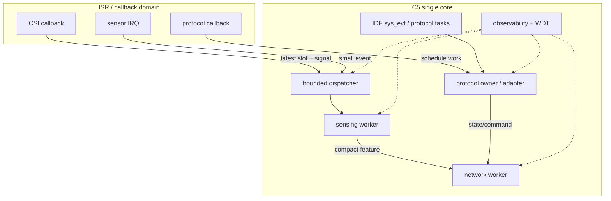

# ESP32-C5 专题：单核、多协议与有界调度

## 1. C5 的设计起点

ESP32-C5 的显著能力是 RISC-V 单核、2.4/5 GHz Wi-Fi 6、BLE 与 IEEE 802.15.4。能力表很强，但调度设计首先要接受两个物理事实：

1. C5 只有一个 CPU core，所有 IDF 系统 task、无线协议、callback、业务 worker 和 idle/WDT 最终共享同一执行资源。
2. 多种无线能力共享射频与天线，协议都能启用不代表它们能同时获得稳定的接收时隙和延迟。

固定源码证据：

- [`SOC_CPU_CORES_NUM = 1`](https://github.com/espressif/esp-idf/blob/f0887bcf8763266effe3fa0b358340df226a04b5/components/soc/esp32c5/include/soc/soc_caps.h#L159-L166)。
- 同一 C5 capability 文件声明 Wi-Fi、5 GHz、BLE 和 IEEE 802.15.4 支持：[C5 `soc_caps.h`](https://github.com/espressif/esp-idf/blob/f0887bcf8763266effe3fa0b358340df226a04b5/components/soc/esp32c5/include/soc/soc_caps.h)。
- IDF task API 明确：单核 target 上 `tskNO_AFFINITY` 仍被视作 core 0：[IDF additions](https://github.com/espressif/esp-idf/blob/f0887bcf8763266effe3fa0b358340df226a04b5/components/freertos/esp_additions/include/freertos/idf_additions.h#L39-L69)。

因此，C5 优化的核心不是“怎样绑核”，而是：每个执行片段是否有界、是否主动让出、优先级是否合理、队列是否有上限、过载时丢什么、失败时谁恢复。

## 2. 把隐藏 task 纳入预算

典型应用代码只看到自己的 dispatcher 和 worker，却容易漏掉：

- IDF main task；
- 默认事件循环 `sys_evt`；
- Wi-Fi driver、TCP/IP、timer 和 idle；
- NimBLE host；
- OpenThread mainloop/radio/netif；
- HTTP、OTA、console 和第三方组件 task。

`esp_event_loop_create_default()` 会创建一个专用 `sys_evt` task，队列长度由 Kconfig 决定，core id 固定为 0。自定义 event loop 才能配置 queue、priority、core，或选择不创建专用 task、由调用者驱动：[default loop](https://github.com/espressif/esp-idf/blob/f0887bcf8763266effe3fa0b358340df226a04b5/components/esp_event/default_event_loop.c#L92-L108)、[custom loop](https://github.com/espressif/esp-idf/blob/f0887bcf8763266effe3fa0b358340df226a04b5/components/esp_event/esp_event.c#L553-L624)。

一个可用的 C5 预算表至少应包含：

| 执行上下文 | 优先级 | 最长单轮 | 阻塞点 | queue/stack | 过载策略 |
|------------|--------|----------|--------|-------------|----------|
| `sys_evt` | Kconfig | handler p99/p999 | event queue | event queue depth | handler 下沉、post 失败计数 |
| sensing callback | driver context | 微秒级目标 | 不允许业务阻塞 | latest slot / small copy | 覆盖旧样本、drop counter |
| dispatcher | 高于业务 worker | 有界路由 | input queue | depth/high-water | 分类 drop/coalesce |
| CSI/传感 worker | 业务优先级 | 算法单轮 | queue receive | bounded work queue | latest-only 或采样降级 |
| network worker | 低于关键 sensing | HTTP/connect timeout | socket/TLS | command/result queue | backoff、deadline、retry budget |
| idle | 0 | 必须获得运行机会 | 无 | WDT | 饥饿即诊断 CPU budget |

不要用“任务正在阻塞 queue，所以不耗 CPU”掩盖 burst。真正危险的是 callback 短时间大量唤醒、worker 单轮过长、日志格式化、TLS、flash 写入和错误重试在同一核上叠加。

## 3. CSI：callback 到 worker 的边界

### 3.1 C5 与 S3 配置并不相同

`esp-csi` 的 `get-started/csi_recv` 对 C5 使用新的 band/bandwidth 与 `wifi_csi_config_t` 字段，并处理 HE-LTF/12-bit force-LLTF；S3/旧 target 走 legacy 配置分支。这说明跨芯片移植 CSI 时不能只复制 callback，driver 配置和数据格式也要按 target 分支核验。

代表源码：[C5/S3 CSI receive](https://github.com/espressif/esp-csi/blob/8633d67152db2808f141cc1595970aa9cf406045/examples/get-started/csi_recv/main/app_main.c#L137-L210)。

### 3.2 较好的隔离模式

`esp-radar/console_test` 的 callback：

1. 复制一个变长 CSI 对象；
2. 用零等待投到容量 64 的 pointer queue；
3. queue full 时立即释放；
4. 独立 task 阻塞取队列后打印/格式化。

证据：[callback](https://github.com/espressif/esp-csi/blob/8633d67152db2808f141cc1595970aa9cf406045/examples/esp-radar/console_test/main/app_main.c#L115-L125)、[consumer](https://github.com/espressif/esp-csi/blob/8633d67152db2808f141cc1595970aa9cf406045/examples/esp-radar/console_test/main/app_main.c#L337-L370)。

它证明了 callback 下沉原则，但仍不是生产模板：分配后未判空、打印 task priority 0、没有 queue high-water/heap 指标。更适合 C5 的版本是固定大小 latest slot 或小型 pool，callback 只复制必要 I/Q/metadata，然后发轻量 signal。

### 3.3 明确反例

- `get-started/csi_recv` 直接在 callback 循环打印整帧，只适合 bring-up。
- `esp-crab/master_recv` 分配后零等待入 pointer queue，却不检查 send 结果；满队列时 consumer 永远拿不到该块，存在泄漏：[producer](https://github.com/espressif/esp-csi/blob/8633d67152db2808f141cc1595970aa9cf406045/examples/esp-crab/master_recv/main/app_main.c#L111-L152)。

### 3.4 推荐 C5 数据路径



关键点是 callback signal 与 payload storage 分离：signal 可以合并，latest slot 可以覆盖，consumer 总能读到最近完整快照，不会积累过期 CSI。

## 4. event loop 与 queue 语义

### 4.1 `esp_event_post` 会复制，不代表必达

普通 `esp_event_post_to()` 会复制 event data；内部发送失败时会释放自己的副本并返回 `ESP_ERR_TIMEOUT`。从 loop 自己的 task 再 post 时，IDF 强制零等待以避免 self-deadlock。ISR 版本只能携带适合内联的小数据并使用 FromISR queue API：[post path](https://github.com/espressif/esp-idf/blob/f0887bcf8763266effe3fa0b358340df226a04b5/components/esp_event/esp_event.c#L960-L1032)、[ISR path](https://github.com/espressif/esp-idf/blob/f0887bcf8763266effe3fa0b358340df226a04b5/components/esp_event/esp_event.c#L1050-L1080)。

框架保证内部副本不泄漏，不保证业务事件必达。调用方仍需决定：

- 状态事件：覆盖/合并；
- telemetry：允许采样/drop；
- 命令：有限重试 + idempotency key；
- 安全事件：独立可靠通道或升级复位策略。

### 4.2 不在高频 producer 使用 `portMAX_DELAY`

IDF batch demo 和 IoT Bridge DNS control event 都出现无限 queue wait。前者是教学代码，后者是低频控制面选择；二者都不适合 CSI、传感或高频状态 producer。单核 C5 上 producer 无限等待还会把上游 driver/协议工作一起卡住。

推荐记录每类事件的语义矩阵：

| 类型 | 入队等待 | 满时处理 | 指标 |
|------|----------|----------|------|
| latest state | 0 | overwrite/coalesce | overwrite count、age |
| normal telemetry | 0 或极短 | drop/sample | drop、depth、latency |
| command | 有限 deadline | retry/NACK | attempts、deadline miss |
| critical transition | 独立容量 | fail closed / reset | fault reason、reboot budget |

## 5. Wi-Fi、BLE 与 802.15.4 并存

### 5.1 OpenThread 支持要分级

ESP-IDF build rules 允许 `ot_cli`/`ot_rcp` 在具备 IEEE 802.15.4 的 target 构建，因此 C5 属于可构建目标；自动测试却明确集中在 H2/C6。C5 light-sleep 示例路径存在，deep-sleep 示例当前因已知问题被禁用：[OpenThread build rules](https://github.com/espressif/esp-idf/blob/f0887bcf8763266effe3fa0b358340df226a04b5/examples/openthread/.build-test-rules.yml#L40-L78)。

正确表述是：

- C5 有 OpenThread CLI/RCP 构建路径；
- 测试覆盖弱于 H2/C6；
- light sleep 有示例；
- deep sleep 不能从“有 802.15.4”直接推断成熟。

OpenThread CLI 示例注册 netif、task queue 和 radio driver 等 eventfd，再启动默认 event loop 与 OpenThread。读取/修改 dataset 前使用 OpenThread lock，避免业务 task 任意并发进入协议栈：[startup](https://github.com/espressif/esp-idf/blob/f0887bcf8763266effe3fa0b358340df226a04b5/examples/openthread/ot_cli/main/esp_ot_cli.c#L48-L93)。

### 5.2 单天线改变 Border Router 方案

`esp-thread-br` 给出非常具体的 C5 产品结论：C5 可作为双频 Wi-Fi 主处理器，但 native 15.4 radio 不用于单芯片 BR，因为单天线让 Wi-Fi 与 Thread 无法同时接收；推荐外接 H2/C6 RCP，并用 Spinel UART/SPI 连接：[C5 caveat](https://github.com/espressif/esp-thread-br/blob/25ab20499f64506ec724a2844a643d9227bceeeb/examples/basic_thread_border_router/README_standalone_RCP.md#L11-L23)。

这不是“C5 不支持 Thread”，而是产品目标不同：

| 目标 | 更合理的方案 |
|------|--------------|
| 低占空比单一 Thread 设备 | C5 native 802.15.4，可按实测共存 |
| 同时承担高吞吐 Wi-Fi backbone + 稳定 Thread BR | C5 + 外置 H2/C6 RCP |
| 需要独立故障域和可升级 radio | 主处理器 + versioned RCP |

Thread BR 的 CLI 在执行阻塞 Wi-Fi connect/disconnect 前释放 OpenThread switching lock，结束后再获取；BR 状态初始化则在 OpenThread lock 内完成：[lock handoff](https://github.com/espressif/esp-thread-br/blob/25ab20499f64506ec724a2844a643d9227bceeeb/components/esp_ot_cli_extension/src/esp_ot_wifi_cmd.c#L267-L328)。这是跨协议边界的好例子：保护状态，但不拿着协议锁做外部阻塞。

### 5.3 BLE 低功耗

NimBLE power-save 示例对 C5 有 target 配置，要求 tickless idle 和 power management。应用配置 CPU 频率上下限，只在 tickless idle 开启时允许 automatic light sleep；`nimble_port_freertos_init()` 创建 host task，业务不需要在自己的 loop 轮询 BLE：[power-save example](https://github.com/espressif/esp-idf/blob/f0887bcf8766effe3fa0b358340df226a04b5/examples/bluetooth/nimble/power_save/main/main.c#L550-L640)。

同一示例通过 max connections/bonds/CCCD、角色、GATT client 和 transport buffer 数量裁剪内存。C5 资源优化应优先关闭不需要的协议能力和并发规模，再调小 task stack；只缩 stack 往往既省不了大头，又增加溢出风险。

## 6. 状态驱动的电源策略

OpenThread sleepy-device 示例在启动/入网时持有 `ESP_PM_CPU_FREQ_MAX` lock，只有角色变为 child 后才 release/delete，让设备在关键阶段保持性能，稳定后允许降频/light sleep：[PM lock lifecycle](https://github.com/espressif/esp-idf/blob/f0887bcf8766effe3fa0b358340df226a04b5/examples/openthread/ot_sleepy_device/light_sleep/main/esp_ot_sleepy_device.c#L48-L104)。

`esp-csi` 的 sensing demo 则显式 `esp_wifi_set_ps(WIFI_PS_NONE)`，优先保证 CSI cadence：[CSI power choice](https://github.com/espressif/esp-csi/blob/8633d67152db2808f141cc1595970aa9cf406045/examples/esp-radar/wifi_sensing_demo/main/app_main.c#L200-L215)。

两者不是矛盾，而是两种运行模式：

```text
BOOT / CONNECT / CALIBRATE / HIGH_RATE_SENSING
  -> hold performance lock or disable Wi-Fi PS

STABLE / LOW_RATE / IDLE
  -> release lock, allow DFS/light sleep

ERROR / RETRY
  -> bounded performance window, then backoff/sleep
```

切换条件要来自状态机，并测量功耗、CSI cadence、丢包、attach time 和唤醒延迟。不能同时把“永不省电”和“始终允许 light sleep”都当默认。

## 7. Matter、Zigbee 与协议栈 ownership

### 7.1 Matter 的单线程状态入口

`esp-matter` Light 将 server 初始化用 `PlatformMgr().ScheduleWork()` 投到 CHIP event-loop task；远端属性先经 PRE_UPDATE 驱动硬件，本地按钮也调用同一 `attribute::update()`。这让本地/远端状态走同一数据模型，而不是两个任务分别写硬件：[Matter init](https://github.com/espressif/esp-matter/blob/0b82a30549606689e6ea050d7579b382406316dc/components/esp_matter/esp_matter_core.cpp#L287-L352)。

值得借鉴的是“协议栈拥有状态，业务只投 work/event”。需要修正的边界包括：

- event queue 满时部分路径只 log/drop；
- startup notification 存在 early return 后不通知的静态死等窗口；
- NVS 延迟写返回值未形成重试/告警。

### 7.2 Zigbee 阅读重点

`esp-zigbee-sdk` 的 C5 示例、pytest marker、endpoint/cluster builder 与 commissioning signal handler共同提供 Zigbee 学习入口。阅读时要区分：

- 应用 callback/signal handler；
- Zigbee stack main loop 与 scheduler alarm；
- endpoint/cluster 数据模型；
- commissioning/rejoin 状态机；
- 预编译 Zigbee stack 内部不可见的 queue、radio arbitration 和 timing。

工程原则与 Matter 相同：协议状态由 stack owner context 串行化，应用 handler 保持短，将传感/网络/flash 重活投给专用 worker。具体 C5 覆盖与实现证据见 [项目索引](01-project-index.md) 和 [来源清单](06-sources.md)。

## 8. 看门狗与阶段活性

Task WDT 不只可以订阅 task，还可以创建 named user handle。后者适合一个长期 worker 内的关键阶段：

```text
CSI worker task is alive
  ├─ process phase user
  ├─ report phase user
  └─ persistence phase user
```

如果 task 周期性 reset，但 HTTP report user 不再 reset，就能区分“task 活着”和“内部阶段卡住”。官方示例同时订阅 task、`func_a`、`func_b`，停止时逐项注销并用 notification 等退出：[Task WDT example](https://github.com/espressif/esp-idf/blob/f0887bcf8766effe3fa0b358340df226a04b5/examples/system/task_watchdog/main/task_watchdog_example_main.c#L18-L101)。

使用 named user 的前提：

- 正常网络 backoff 不被误判；
- user 生命周期与 task/phase 对称注册、注销；
- 超时日志能打印 queue、state、attempt 和最近进度；
- WDT 是最后防线，不替代 bounded timeout。

## 9. RCP 更新与 reboot budget

Thread BR 的 RCP 更新展示了外设协处理器恢复：比较运行版本与内置镜像，不同则 deinit radio、重刷，单 binary 最多重试 3 次，更新 verified 标记后重启：[decision](https://github.com/espressif/esp-thread-br/blob/25ab20499f64506ec724a2844a643d9227bceeeb/components/esp_rcp_update/src/esp_ot_rcp_update.c#L25-L78)、[flash retry](https://github.com/espressif/esp-thread-br/blob/25ab20499f64506ec724a2844a643d9227bceeeb/components/esp_rcp_update/src/esp_rcp_update.c#L231-L288)。

它适合学习版本校验、有限重试和双槽标记，但仍缺少整机级持久 reboot budget。产品应额外记录：

- 最近失败阶段和错误码；
- 同一镜像/外设连续失败次数；
- 跨 reboot 的 attempt count；
- 达上限后禁止自动重刷，进入 safe mode；
- 人工恢复/新镜像清除 budget 的条件。

## 10. C5 推荐架构模板



约束：

- dispatcher 不做算法和网络；
- worker 每轮有 max items/max time；
- state 和 telemetry 可合并，command 有 ACK；
- callback 不 malloc 大对象，或使用固定 pool；
- network 失败不占住 sensing worker；
- flash/NVS 走低频 checkpoint；
- 所有 queue 和 retry 都有上限；
- idle 必须持续获得运行机会。

## 11. C5 故障注入清单

| 实验 | 注入方式 | 观察项 | 通过条件 |
|------|----------|--------|----------|
| CSI burst | 提高 callback cadence | overwrite/drop、worker latency、idle/WDT | 无 callback 阻塞，无 heap 增长 |
| 慢算法 | 人为延长 processing | latest age、queue depth、CPU | 旧状态不积压，网络仍可恢复 |
| queue full | 暂停 consumer | send return、payload release | 无 pointer 泄漏，策略符合类型 |
| 坏 Wi-Fi 凭据 | 持续认证失败 | reason、backoff、日志率 | 有上限+jitter，不 reboot storm |
| 断 S3 | HTTP/链路不可达 | sensing cadence、retry budget | sensing 不被网络永久阻塞 |
| BLE/Thread 并存 | 同时增大无线活动 | CSI cadence、attach、RSSI、功耗 | 有明确性能模式/降级策略 |
| low power | 切换 PM state | 唤醒、丢包、采样间隔 | 状态转换可重复且指标达标 |
| RCP 损坏 | 版本错/刷写失败 | retry、verified、reboot count | 达上限进入 safe mode |
| stop during I/O | 在 HTTP/flash/queue wait 时停止 | join time、资源计数 | deadline 内 STOPPED，无残留 task |

## 12. C5 明确不要复制的模式

- 认为 `tskNO_AFFINITY` 能在单核上隔离任务；
- 在 CSI/Wi-Fi callback 打整帧、做 HTTP 或 flash；
- `malloc` 后不判空，pointer queue send failure 不释放；
- 高频 producer 使用 `portMAX_DELAY`；
- got-IP/重连事件每次新建 worker，没有幂等 guard；
- 只调 stack，不裁剪协议角色/连接/缓存规模；
- 单天线同时满载 Wi-Fi、Thread、BLE，却没有射频实验和降级模式；
- 失败立即 reboot，但没有跨 reboot attempt budget；
- 用 WDT 重启代替 queue deadline、socket timeout 和状态机恢复。

