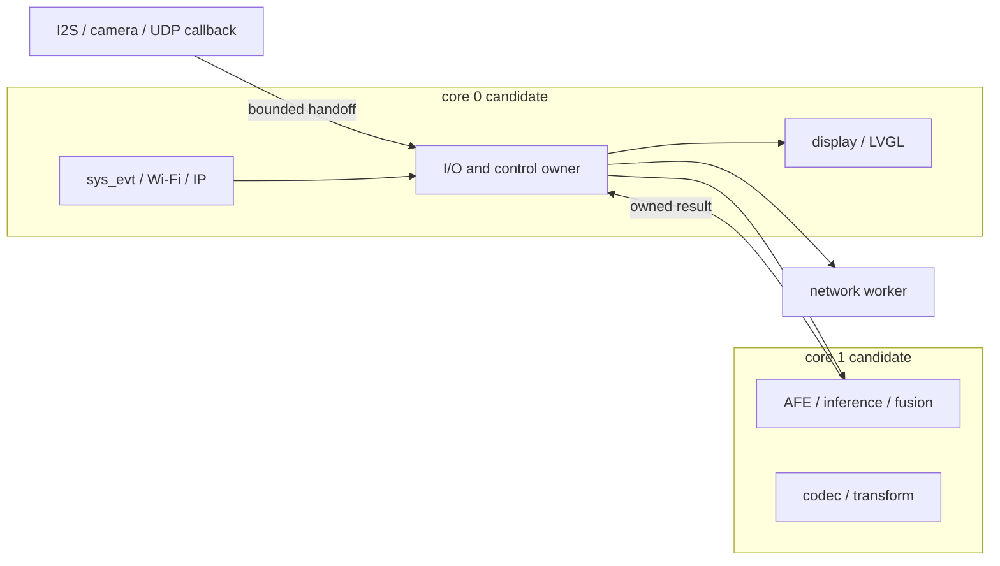
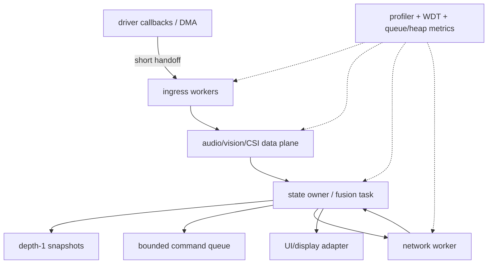

# ESP32-S3 专题：双核、多媒体与网关调度

## 1. S3 的优势与误区

ESP32-S3 具有双核 Xtensa LX7、向量/AI 加速能力、USB、丰富外设和常见的大容量 PSRAM 配置，适合音频、视觉、显示、网关和复杂产品固件。最常见误区是：

> 双核会自动把 Wi-Fi、系统事件、媒体 pipeline 和业务任务隔离开。

事实是：

- S3 `SOC_CPU_CORES_NUM` 为 2：[S3 capability](https://github.com/espressif/esp-idf/blob/f0887bcf8763266effe3fa0b358340df226a04b5/components/soc/esp32s3/include/soc/soc_caps.h#L145-L149)。
- 默认 ESP event loop 的 `sys_evt` 仍固定 core 0：[default loop](https://github.com/espressif/esp-idf/blob/f0887bcf8763266effe3fa0b358340df226a04b5/components/esp_event/default_event_loop.c#L92-L108)。
- 普通 `xTaskCreate` 创建的 task 没有确定 core ownership；调度器可迁移它。
- 第三方组件还会创建 Wi-Fi、HTTP、timer、LVGL、codec、camera、USB 和协议 task。

所以 S3 的问题不是“有没有第二核”，而是：哪些状态必须单 owner，哪些 CPU-heavy 工作适合隔离，core 0 的系统负载有多大，跨核 payload 的 ownership 是否清楚。

## 2. 先画真实任务图

S3 产品至少要区分四类执行上下文：

| 类别 | 例子 | 主要风险 |
|------|------|----------|
| 系统/协议 | `sys_evt`、Wi-Fi、TCP/IP、timer、OpenThread/Matter | 长 handler、隐藏 priority、core 0 拥塞 |
| 实时/采集 | I2S、camera、motor FOC、CSI ingress | deadline、DMA buffer、不可阻塞 callback |
| CPU-heavy | AFE、Opus、检测/识别、融合 | 饿死 idle、跨核 cache/PSRAM 延迟 |
| 控制/网络/UI | state owner、HTTP、MQTT、LVGL、display | 无界 queue、同步网络等待、生命周期重入 |

可用的起始拓扑不是固定答案，而是一组 ownership 假设：



是否这样分核，必须通过真实 Wi-Fi/CSI/audio/camera workload 的 p99/p999 延迟、queue high-water、stack 和 WDT 结果决定。

## 3. 三种音频调度模型

### 3.1 ESP-ADF：每个 element 一个 task

ADF pipeline 不是单一 task。每个具有 stack 的 audio element 创建独立 task，config 显式携带 `task_stack`、`task_prio`、`task_core`、output ringbuffer size 和 external-stack 选择。默认 element 配置约为 2 KiB stack、priority 5、core 0、8 KiB output ringbuffer：[element config](https://github.com/espressif/esp-adf/blob/b875a6e3385f730a49794a59954d4b7940502962/components/audio_pipeline/include/audio_element.h#L157-L190)、[task create](https://github.com/espressif/esp-adf/blob/b875a6e3385f730a49794a59954d4b7940502962/components/audio_pipeline/audio_element.c#L1085-L1119)。

数据面和控制面分离：

```text
source element ==ringbuffer==> decoder ==ringbuffer==> sink
       |                           |                    |
       +--------- event queues / QueueSet ------------+
```

- 数据用 ringbuffer；
- command/status 用 internal/external event queue；
- listener 用 QueueSet 聚合多个 event iface；
- 默认 event queue 只有 5 项，send 零等待，满时返回失败并 warning。

证据：[event iface](https://github.com/espressif/esp-adf/blob/b875a6e3385f730a49794a59954d4b7940502962/components/audio_pipeline/audio_event_iface.c#L51-L155)、[zero-wait send](https://github.com/espressif/esp-adf/blob/b875a6e3385f730a49794a59954d4b7940502962/components/audio_pipeline/audio_event_iface.c#L241-L277)。

ADF 最值得借鉴的是流结束合同：`rb_done_write()` 表示正常 EOF，`rb_abort()` 同时标记 read/write abort 并唤醒双方；element stop 先 abort input/output ringbuffer，再等 task state：[ringbuffer](https://github.com/espressif/esp-adf/blob/b875a6e3385f730a49794a59954d4b7940502962/components/audio_pipeline/ringbuf.c#L161-L250)、[element stop](https://github.com/espressif/esp-adf/blob/b875a6e3385f730a49794a59954d4b7940502962/components/audio_pipeline/audio_element.c#L1245-L1269)。

### 3.2 esp-sr：API 内部缓冲的 feed/fetch

esp-sr 的外部拓扑是 producer `feed()` + consumer `fetch()`，内部 AFE/ringbuffer 位于预编译库：

```text
I2S producer -> feed(interleaved 16 kHz int16)
             -> opaque AFE / internal buffer
             -> fetch(single-channel + VAD/WakeNet/raw/pressure)
             -> recognizer / application
```

`fetch()` 默认最多等 2000 ms，也有 ticks 版本。result 没有独立 free API和跨 fetch 生命周期说明，应按 borrowed view 处理，过 task 前复制：[AFE API](https://github.com/espressif/esp-sr/blob/7ff63a7da40e15e502681be48c4d0e78475544a3/include/esp32s3/esp_afe_sr_iface.h#L27-L124)。

文档把 feed/fetch 放 core 0/1，性能测试却两者都放 core 0；这证明亲和性是样例配置，不是 API 规范。更重要的是停止顺序：先停 feed/fetch 并 join，再 destroy AFE 实例，最后 deinit model mmap。文档示例让 fetch 遇错直接 destroy 仍被无限 feed 使用的共享对象，是应避免的生命周期反例：[example risk](https://github.com/espressif/esp-sr/blob/7ff63a7da40e15e502681be48c4d0e78475544a3/docs/en/audio_front_end/README.rst#L158-L216)。

### 3.3 Xiaozhi：有界队列 + `unique_ptr` move

Xiaozhi 将应用可见的音频拆为 input、output、Opus codec 三 task：

| task | S3 默认 | 数据责任 |
|------|---------|----------|
| input | priority 8、core 0、6144 byte stack | codec input、10 ms feed、AFE/wake、生成 encode work |
| output | priority 4、4096 byte stack | 消费 PCM playback、写 speaker |
| Opus | priority 2、24576 byte stack | 编码 MIC、解码网络 packet |

证据：[audio task creation](https://github.com/78/xiaozhi-esp32/blob/7b190b78e4f8dfef14126f6cd478c134b3cd3cd8/main/audio/audio_service.cc#L125-L166)。

队列上限为：PCM encode/playback 各 2，Opus send/decode 各 40。payload 使用 `unique_ptr` move，所有权优于裸指针；但 encode queue 满会阻塞高优先级 input，把压力传回采集 cadence，decode full 返回 `false` 又被调用方忽略。必须同时观测 depth、block time、audio gap 和 drop，而不是只看“内存有上限”。

## 4. 视觉：latest frame 与 buffer lease

ESP-WHO 的 S3 人脸识别代表路径：

```text
core 0, p2                    core 1, p2
FrameCapFetch --NEW_FRAME--> Detect --callback--> recognize/enroll
      |
      +------NEW_FRAME------> LCD (display older frame)

camera pool: 6 framebuffers
application ring: 4 raw cam_fb_t pointers
```

源码入口：[pipeline config](https://github.com/espressif/esp-who/blob/2475f1456e49492d71e2e20e499377a8fd747ae4/examples/human_face_recognition/main/frame_cap_pipeline.cpp#L7-L29)、[fetch/publish](https://github.com/espressif/esp-who/blob/2475f1456e49492d71e2e20e499377a8fd747ae4/components/who_frame_cap/who_frame_cap_node.cpp#L99-L174)、[detect](https://github.com/espressif/esp-who/blob/2475f1456e49492d71e2e20e499377a8fd747ae4/components/who_detect/who_detect.cpp#L59-L95)。

这个设计的优点：

- `NEW_FRAME` bit 合并，慢模型自然跳帧；
- Detect 总取最新，避免历史 backlog；
- LCD 取滞后帧，用 timestamp 选择匹配的检测结果；
- frame pool/ring 容量显式。

核心风险：`cam_fb_peek()` 只在取 pointer 时持 mutex，返回后没有 lease/refcount；Fetch 可能将旧 buffer 归还 camera driver，DMA 随后复用。ring 深度只是时序裕量，不是 ownership protocol：[peek](https://github.com/espressif/esp-who/blob/2475f1456e49492d71e2e20e499377a8fd747ae4/components/who_frame_cap/who_frame_cap_node.cpp#L53-L75)。

产品化可选方案：

1. consumer acquire/release lease，最后一个引用归还 driver；
2. 每个 consumer 复制所需区域/缩略图；
3. 固定 pool + generation id，consumer 使用前验证未被复用；
4. 硬 deadline，过期主动放弃，不再访问 pointer。

## 5. `Yield2Idle`：有损恢复不是调度优化

ESP-WHO 的 `Yield2Idle` 以最高优先级、no-affinity 运行。如果观测到某 core 一个周期没有进入 idle，它暂停该核上的 ESP-WHO task、cleanup、延迟 10 ms、再 resume：[implementation](https://github.com/espressif/esp-who/blob/2475f1456e49492d71e2e20e499377a8fd747ae4/components/who_task/who_yield2idle.cpp#L85-L166)。

它的含义是：

- 可以给 idle/WDT 一次运行机会；
- 会清 frame/result 状态，属于有损恢复；
- 若模型正常单轮大于阈值，会误触发；
- 不能修复永久阻塞的 camera get 或错误 priority 设计；
- 最高优先级 watchdog task 自身也要纳入 CPU 预算。

对网关或 CSI 系统，优先选择 bounded work、显式 yield、task WDT/phase WDT 和队列 age；只有在业务允许丢整个 pipeline state 时，才考虑类似有损恢复。

## 6. HMI/服务：Brookesia 的线程池与 strand

Brookesia 不是“一服务一 FreeRTOS queue”，而是在 ESP pthread/Boost.Asio 上建立 task scheduler：

- `io_context` 管 immediate、delayed、periodic task；
- 多个 `ThreadConfig` 创建可指定 core/priority/stack/PSRAM 的 worker；
- group 可绑定 strand，让同组任务串行；
- promise/future 支持 cancel、wait 和统计；
- ServiceManager 通过 RAII binding 管服务和依赖。

console 示例使用 core 0/core 1 两个 10 KiB backend worker：[console](https://github.com/espressif/esp-brookesia/blob/39871f5f0f491fec476e54b8736661e73f3c8997/examples/service/console/main/main.cpp#L66-L116)。ServiceManager Kconfig 默认 3 个 worker，core 0、core 1、no-affinity，priority 5、15 KiB、external stack：[Kconfig](https://github.com/espressif/esp-brookesia/blob/39871f5f0f491fec476e54b8736661e73f3c8997/service/framework/brookesia_service_manager/Kconfig#L35-L109)。

### 6.1 周期任务是 fixed-delay

periodic callback 返回后才安排下一次 `expires_after(interval)`，并用 `is_executing` 防重入。所以实际间隔近似：

```text
period = callback_duration + configured_interval + poll/scheduling jitter
```

它不会积压同一个 periodic task，也不是精确采样时钟：[periodic source](https://github.com/espressif/esp-brookesia/blob/39871f5f0f491fec476e54b8736661e73f3c8997/utils/brookesia_lib_utils/src/task_scheduler.cpp#L974-L1048)。

### 6.2 strand 是 ownership，不是吞吐增强

串行 group 适合：

- 一个 service 的状态修改；
- 同一设备/连接的命令；
- 需要顺序的 lifecycle；
- 避免到处加 mutex 的对象 ownership。

CPU-heavy task 若全塞同一 strand，会变成 head-of-line blocking。数据流仍应使用专用 ring/pool，控制 task 保持短。

### 6.3 stop 仍需 callback 协作

Scheduler stop 会 cancel pending、stop `io_context`、interrupt 并 `join_all()` worker，再清 task/group/strand。`join_all()` 没有总体 timeout；运行 callback 若不经过 interruption point 或永久阻塞，stop 仍可能卡住：[stop](https://github.com/espressif/esp-brookesia/blob/39871f5f0f491fec476e54b8736661e73f3c8997/utils/brookesia_lib_utils/src/task_scheduler.cpp#L127-L182)。

此外 ServiceManager 的最后 unbind 先把 state 设为 Idle，解锁后才 stop；另一个 bind 可能在旧 stop 完成前重新 start。产品级 lifecycle 需要 `Stopping`/generation 或单 owner context。

## 7. 实时双核实例：SmartKnob

SmartKnob 的 S3 板型环境把 Display/Interface 固定 core 0，Motor 固定 core 1；setup 后删除 Arduino loop task：[topology](https://github.com/scottbez1/smartknob/blob/4eb988399c3fda6ffd3006772856093dfe9adb86/firmware/src/main.cpp#L8-L42)。Motor task 独占 FOC 状态，每轮最多取一条命令，约每 5 ms 发布状态，末尾 delay 1 ms。

最值得借鉴的是 state listener：

- 每个 listener 一个容量 1 value queue；
- producer 用 `xQueueOverwrite()`；
- Display 阻塞等最新状态；
- 慢 UI 不会累积旧 motor state。

证据：[publish](https://github.com/scottbez1/smartknob/blob/4eb988399c3fda6ffd3006772856093dfe9adb86/firmware/src/motor_task.cpp#L336-L343)、[display receive](https://github.com/scottbez1/smartknob/blob/4eb988399c3fda6ffd3006772856093dfe9adb86/firmware/src/display_task.cpp#L53-L66)。

限制同样明确：command queue depth 5 且 send `portMAX_DELAY`；校准在 Motor task 内执行长 delay，producer 可能永久等。日志使用 `new std::string` + zero-wait pointer queue却忽略失败，queue full 会泄漏。可以复制 state 语义，不能复制命令等待和 pointer ownership。

## 8. 产品状态 owner：Xiaozhi

Xiaozhi 将 IDF main task 提升 priority 10，用 EventGroup 和 `Schedule()` deque集中主要副作用：

- 状态机维护合法转移白名单；
- listener 在锁内复制、锁外回调；
- listener 只置 state-changed bit；
- network/timer callback move closure 到 deque；
- main task 批量 swap 后执行。

证据：[state machine](https://github.com/78/xiaozhi-esp32/blob/7b190b78e4f8dfef14126f6cd478c134b3cd3cd8/main/device_state_machine.cc#L34-L160)、[Schedule](https://github.com/78/xiaozhi-esp32/blob/7b190b78e4f8dfef14126f6cd478c134b3cd3cd8/main/application.cc#L934-L940)。

这是清晰的 owner-task 模式，但当前 deque 无容量、drop 和 latency。更危险的是 main task 会同步等待 MQTT/WebSocket hello 最多 10 秒，期间 UI、state 和 scheduled callbacks 全部推迟：[MQTT wait](https://github.com/78/xiaozhi-esp32/blob/7b190b78e4f8dfef14126f6cd478c134b3cd3cd8/main/protocols/mqtt_protocol.cc#L215-L238)。

改进方式：

- owner task 只启动异步 operation；
- network worker 持有 socket/TLS；
- completion 带 generation/id 回 owner；
- owner 有 pending operation deadline；
- `Schedule()` 按类型设容量：STATE coalesce、COMMAND bounded、ERROR reserved；
- 记录 enqueue age 和最长 handler。

## 9. PSRAM：容量不是唯一维度

IDF 允许为 task stack/queue 指定 memory caps，但 TCB 仍在 internal RAM，且必须使用配套 delete API：[caps APIs](https://github.com/espressif/esp-idf/blob/f0887bcf8763266effe3fa0b358340df226a04b5/components/freertos/esp_additions/include/freertos/idf_additions.h#L256-L383)。

适合放 PSRAM：

- 大型非 ISR task stack；
- camera frame、模型权重和大音频 buffer；
- 可容忍 cache miss 的历史数据；
- 明确由 task context 访问的对象。

慎放或保留 internal：

- ISR/driver 需要的 DMA/control metadata；
- 低延迟 queue control block；
- 高频 lock/flag；
- flash/cache-disabled 窗口仍需访问的 stack/data；
- WDT/recovery 路径。

需要测量的不是只有 free bytes：

| 指标 | 说明 |
|------|------|
| internal/PSRAM largest free block | 碎片是否阻止下一次大分配 |
| stack high-water | 是否过度配置或接近溢出 |
| task wake-to-run latency | PSRAM/cache 对实时入口的影响 |
| queue/block p99 | slow consumer 是否放大 |
| camera/audio underrun | 大 buffer 是否真正改善连续性 |
| flash/cache-disabled safety | external stack 路径是否允许 |

## 10. 网络网关：控制面不能拖住媒体面

IoT Bridge 把 Station 固定为 WAN/DHCPC、SoftAP 固定为 LAN/DHCPS/NAPT；got-IP 后同步 DNS和检查网段冲突，必要时迁移 LAN 地址。这个 WAN/LAN 边界适合 S3 网关，但它在 DHCP hook 用 `esp_event_post(..., portMAX_DELAY)`，重连又直接 `esp_wifi_connect()`，没有 reason/backoff/jitter：[DNS event](https://github.com/espressif/esp-iot-bridge/blob/667766b0feefb199afc5de7c59fc330048641fcb/components/iot_bridge/src/bridge_common.c#L731-L794)、[reconnect](https://github.com/espressif/esp-iot-bridge/blob/667766b0feefb199afc5de7c59fc330048641fcb/components/iot_bridge/src/bridge_wifi.c#L157-L178)。

S3 网关应分开：

```text
control plane: connect, credentials, address migration, command/ACK
data plane: CSI/audio/video/telemetry stream
observability: queue, link age, retries, WDT, heap
```

控制面可以有有限等待和强一致，数据面应 latest/coalesce/drop，二者不能共享一个无限等待 queue。

## 11. 恢复与 OTA

Xiaozhi 的成熟点包括 boot rollback/mark-valid、4 KiB internal OTA buffer、镜像验证和 activation 指数退避。静态缺口包括 read error 后未 `esp_ota_abort()`、手动升级失败停留 Upgrading、AudioService stop 未 join便可能 restart：[OTA path](https://github.com/78/xiaozhi-esp32/blob/7b190b78e4f8dfef14126f6cd478c134b3cd3cd8/main/ota.cc#L247-L387)、[audio stop](https://github.com/78/xiaozhi-esp32/blob/7b190b78e4f8dfef14126f6cd478c134b3cd3cd8/main/audio/audio_service.cc#L169-L182)。

完整升级状态机应包含：

```text
IDLE
 -> PREPARE (close admission)
 -> QUIESCE (stop + join media/network tasks)
 -> DOWNLOAD (deadline + abort handle on every failure)
 -> VERIFY
 -> SWITCH
 -> REBOOT_PENDING

failure at any stage
 -> cleanup acquired resources
 -> restore previous services
 -> state returns IDLE or DEGRADED
```

状态、资源和 task 是否运行必须一致，不能只恢复 UI 文案。

## 12. S3 推荐架构模板



推荐合同：

- callback 不做 decode/inference/network；
- data plane 使用 ring/pool，明确 EOF/abort/timeout；
- owner task 串行状态转移，网络 completion 带 generation；
- UI 只消费 snapshot，不拥有核心设备状态；
- STATE depth-1，COMMAND 有限重试，ERROR 有预留容量；
- 先 profile 再绑核；
- PSRAM 对象有明确 capability 和 delete API；
- stop 先 wake，再 bounded join；
- WDT 同时看 task 和 phase。

## 13. S3 故障注入清单

| 实验 | 观察项 | 通过条件 |
|------|--------|----------|
| core 1 CPU burn | core 0 event latency、Wi-Fi loss、WDT | 系统事件仍及时，队列不失控 |
| core 0 log burst | audio/camera deadline、sys_evt latency | 重活已下沉，日志限频 |
| slow AFE/inference | frame/audio queue、latest age、drop | 不无界积压，状态仍新鲜 |
| camera buffer hold | frame lease、DMA reuse、tearing | consumer 不访问已归还 buffer |
| audio consumer pause | ring fill、input block、gap | 有界内存、明确 drop/backpressure |
| network hello timeout | owner queue age、UI/state responsiveness | owner task 不同步阻塞 |
| repeated disconnect | reason/backoff/jitter、attempt budget | 不高频重试，不丢 one-shot recovery |
| PSRAM pressure | largest block、allocation fallback | 失败可回滚，关键控制仍在 internal |
| stop during block | stop duration、残留 task/buffer | deadline 内停止，所有 wait 被唤醒 |
| OTA read/write fault | abort、state、service restore | handle 清理，状态与运行资源一致 |

## 14. S3 明确不要复制的模式

- 只因有双核就任意绑 task，没有测 core-0 `sys_evt` 和 Wi-Fi 负载；
- 把 ADF 默认 core 0 或某个 demo priority 当通用最佳值；
- borrowed AFE result 或 camera buffer 裸指针跨队列长期保存；
- 用 ring 深度代替 lease/refcount；
- 控制命令用 EventGroup bit 合并，却误以为每条命令都保留；
- 无容量 `std::queue` / `Schedule()` deque；
- 最高优先级恢复 task 清状态，却不记录有损恢复次数；
- owner/main task 同步等网络/TLS；
- stop 只置 flag，不 wake/join；
- PSRAM task 用普通 delete 或在 cache-unsafe 路径运行；
- OTA 失败后只恢复 UI，不恢复状态机和 task 生命周期。

