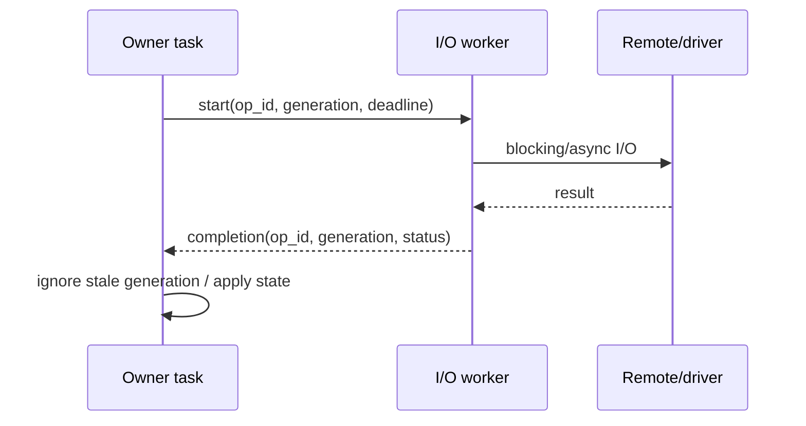

# 调度与可靠性模式横向比较

## 1. 总览

本章把 13 个深读项目归纳为 12 类机制。每类机制都要回答四件事：

1. 谁拥有状态或 payload？
2. 过载、失败、取消和停止时发生什么？
3. 哪些执行上下文允许阻塞？
4. 怎样证明它在真实负载下工作？

| # | 机制 | 代表项目 | 主要结论 |
|---|------|----------|----------|
| 1 | task topology / core affinity | ESP-IDF、ESP-WHO、SmartKnob、esp-hal | 先画隐藏 task，再 profile；核数不等于隔离 |
| 2 | callback / handler 边界 | esp-csi、ESP-IDF、Zigbee | callback 只校验、复制、signal/post |
| 3 | state / data / command 通道 | SmartKnob、ADF、Matter、Xiaozhi | 三种流必须使用不同背压合同 |
| 4 | payload ownership | esp-csi、Xiaozhi、ESP-WHO、esp-sr | send failure、覆盖、取消和 stop 都要有 owner |
| 5 | backpressure / overload | ADF、ESP-WHO、esp-hal | bounded 不等于正确；要定义 drop/block/lag |
| 6 | timer / cadence | Brookesia、Zigbee、esp-hal | timer callback 只投递；区分 fixed-delay/fixed-rate |
| 7 | event loop / state owner | ESP-IDF、Matter、Xiaozhi、Brookesia | 串行 owner 简化状态，但不能放长阻塞 |
| 8 | stop / cancellation | ADF、Brookesia、ESP-WHO、esp-sr | close admission -> wake -> bounded join -> release |
| 9 | watchdog / observability | ESP-IDF、Brookesia、ESP-WHO | task 与 phase 活性分开，恢复代价必须计量 |
| 10 | reconnect / recovery | IoT Bridge、Thread BR、Xiaozhi | reason + bounded backoff + persistent reboot budget |
| 11 | persistence / OTA | Matter、Zigbee、Xiaozhi、Thread BR | RAM truth、checkpoint、升级状态和失败回滚分层 |
| 12 | memory / power / radio | IDF、ADF、WHO、esp-hal、Thread BR | PSRAM、PM 和多协议都必须按状态与时延验证 |

## 2. 机制一：task topology 与 core affinity

### 2.1 三种常见拓扑

| 拓扑 | 结构 | 优点 | 风险 | 代表 |
|------|------|------|------|------|
| 单 owner task | callback/post -> 一个串行 owner | 状态简单、少锁 | owner 长阻塞导致全局停顿 | Matter、Zigbee、Xiaozhi main |
| pipeline task | 每 stage 一 task + stream | 吞吐和功能分层 | task/stack 多、stop 复杂 | ADF、WHO、Xiaozhi audio |
| worker pool + group | 多 worker + serial group/strand | 并发与局部串行兼顾 | head-of-line、线程池 stop | Brookesia |

没有一种拓扑适合所有流。C5 单核通常优先 owner + 少量 worker，减少 context switch 和 stack；S3 多媒体可使用 pipeline，但需要把系统 task、driver task 和 third-party task 一起列入总图。

### 2.2 affinity 的判断顺序

1. 确认芯片核数与系统 task 位置。
2. 记录每个 task 的 priority、runtime、wake rate、stack、blocking call。
3. 识别必须单核的 driver/protocol限制。
4. 在真实 workload 下测不绑核基线。
5. 只移动 CPU-heavy 或有确定 cache/locality 收益的 task。
6. 对比 core-0 event latency、queue high-water、WDT 和功耗。

S3 的 `sys_evt` 固定 core 0，因此“把算法固定 core 1”是合理实验，但不是无条件答案。esp-hal 还展示了一个隐藏变量：S3 从哪个核调用 `WifiController::new()`，会决定 blob Wi-Fi task 的核归属：[core binding](https://github.com/esp-rs/esp-hal/blob/035f29ce083794e845a81efe3c43cca6c944c1dd/esp-radio/src/wifi/mod.rs#L2321-L2381)。

### 2.3 参数不可复制

ESP-WHO 的四个应用 task 都 priority 2，SmartKnob motor task 固定 core 1，ADF element 默认 core 0，Xiaozhi input priority 8/core 0。它们服务于完全不同的 workload、系统版本和 hidden tasks。可复制的是 ownership 和数据合同，不是数字。

## 3. 机制二：callback、ISR 与 event handler

### 3.1 允许做什么

| 上下文 | 可以做 | 不应做 |
|--------|--------|--------|
| ISR | 读取状态、写固定 slot、FromISR signal/queue | malloc、日志、网络、普通 mutex、flash |
| driver callback | 有界校验/复制、zero-wait post | 大帧格式化、算法、HTTP、无限等待 |
| default event handler | 更新小状态、投给预创建 worker | DNS 全量同步、TLS、创建重复 task、长 sleep |
| protocol main-loop callback | 严格校验、调用短 stack API、post业务事件 | 阻塞 I/O、跨线程乱入、长业务 callback |
| timer callback | 设置 bit/notification、投递 token | CSI fusion、持久化、网络请求 |

### 3.2 为什么 `esp_event` 仍会阻塞

同一个 ESP event loop 上 handler 串行执行。event data 会复制，queue full 可返回 timeout，但 handler 本身的执行时间仍由应用控制：[IDF post](https://github.com/espressif/esp-idf/blob/f0887bcf8763266effe3fa0b358340df226a04b5/components/esp_event/esp_event.c#L960-L1032)。

一个 handler 的生产级模板：

```c
static void handler(void *ctx, esp_event_base_t base, int32_t id, void *data)
{
    small_event_t event = normalize(base, id, data);
    if (!try_post(event)) {
        metrics.event_drop++;
        latest_state_update(event);
    }
}
```

这里的关键不是 C 代码形式，而是：normalize 有界、post 不阻塞、失败被计量、状态类事件仍能更新 latest snapshot。

### 3.3 文档不能替代实现

Zigbee `switch_driver.h` 声称 callback 在 ISR，实际 ISR 只入 queue，priority-10 task 才调用 callback：[header](https://github.com/espressif/esp-zigbee-sdk/blob/7eff0fbe19bcf2acd112ba0b5f080530efc49626/examples/utils/switch_driver/include/switch_driver.h#L38-L66)、[source](https://github.com/espressif/esp-zigbee-sdk/blob/7eff0fbe19bcf2acd112ba0b5f080530efc49626/examples/utils/switch_driver/src/switch_driver.c#L23-L55)。调度审计应从实际调用链确认 context，再决定能否阻塞。

## 4. 机制三：状态、数据和命令通道

### 4.1 三类语义

```text
STATE:   old value loses meaning after new value arrives
DATA:    ordered bytes/frames may carry continuity and EOF
COMMAND: each accepted item may require result/ACK/idempotency
```

| 类型 | 典型容器 | 满时行为 | 停止语义 |
|------|----------|----------|----------|
| STATE | depth-1 queue、atomic snapshot、EventGroup bit | overwrite/coalesce | 发布 final state / invalidate generation |
| DATA | ringbuffer、bounded deque、frame pool | block/drop/sample，必须明确 | EOF / abort / timeout |
| COMMAND | bounded queue + id/result | reject/NACK/retry | cancel result / deadline exceeded |

### 4.2 STATE：SmartKnob 和 WHO

SmartKnob 每个 listener 一个 depth-1 value queue，用 `xQueueOverwrite()`；Display 慢时只丢历史状态，不会积压：[state publish](https://github.com/scottbez1/smartknob/blob/4eb988399c3fda6ffd3006772856093dfe9adb86/firmware/src/motor_task.cpp#L336-L343)。

ESP-WHO 用 `NEW_FRAME` EventGroup bit + ring latest frame。相同 bit 多次 set 合并，Detect 落后时跳帧。适合“只要最新”，不适合每个动作必达。

### 4.3 DATA：ADF 和 Xiaozhi

ADF ringbuffer 把连续数据与 event queue 分开，并定义 EOF/abort。Xiaozhi 的 PCM/Opus queue 有明确容量并用 `unique_ptr` move，但不同 queue 的满载行为不一致：input block、decode drop。两者都说明数据流的连续性和内存上限必须共同考虑。

### 4.4 COMMAND：不要用 bit 合并

ESP-WHO recognition command 使用 EventGroup bits。同一轮如果多个 bit 同时到达，wait 清掉全部，而 handler先处理一个后 `continue`，其他命令可能丢失。这不是 EventGroup bug，而是把命令放进 coalescing primitive 的语义后果。

命令通道应包含：

- command id / generation；
- accepted/rejected result；
- execution deadline；
- idempotency rule；
- cancel/stop result；
- bounded retry policy。

## 5. 机制四：payload ownership

### 5.1 ownership 状态表

对每个跨上下文 payload，至少填写：

| 转移点 | 当前 owner | 成功后 owner | 失败后动作 | 覆盖/取消 | stop |
|--------|------------|-------------|------------|-----------|------|
| producer allocate | producer | queue/consumer | producer free | release old | drain/free |
| value copy | producer保留原值 | queue 内副本 | 无额外 free | replace value | queue delete |
| `unique_ptr` move | producer | queue item | move 未发生，producer保留 | old unique_ptr drop | clear deque |
| borrowed view | library/driver | 不转移 | 不能 free | 可能失效 | stop前归还/复制 |
| reference-count lease | pool | consumer lease | release lease | generation invalid | wait/cancel leases |

### 5.2 正向模式

- `esp_event` 内部复制并在 send failure 清理内部 post。
- Xiaozhi 用 `unique_ptr` 在队列间 move。
- Brookesia `ServiceBinding` move-only，RAII 释放服务和依赖。
- esp-hal driver Drop、Wi-Fi RX drain 和 timer deferred free形成局部资源合同。

### 5.3 风险模式

- esp-csi / SmartKnob 裸 pointer queue忽略 send failure，分配块泄漏。
- esp-sr fetch result 是 borrowed view，却没有跨 fetch 生命周期承诺。
- ESP-WHO camera pointer离开 ring mutex 后没有 lease，Fetch 可先归还给 DMA。
- 无界 `std::queue` 或 deque延迟最终表现为 heap pressure，不是“暂时慢”。

### 5.4 单一释放函数

C/C++ 复杂 event 最好建立统一 release：

```text
event_release(event)
  -> free/return payload by kind
  -> clear pointer and generation
  -> update release/drop metrics
```

所有 push failure、replace old、drop background、cancel、drain 和 teardown 都调用它。这样 ownership 审计不需要追踪十几个不同 free 分支。

## 6. 机制五：背压和过载

### 6.1 四种策略

| 策略 | 适用 | 优点 | 风险 |
|------|------|------|------|
| block | 必须保持短期连续的数据、consumer确定会恢复 | 不主动丢 | 传播停顿，可能卡实时采集 |
| drop newest | 已排队数据更重要 | 保序 | 状态变旧 |
| drop oldest / overwrite | 最新状态/画面最重要 | freshness | 历史不可重放 |
| coalesce/sample | 高频 telemetry/state | 控制成本 | 需要定义合并函数和 age |

### 6.2 bounded 不等于可靠

esp-hal Wi-Fi event channel默认 capacity 2，满时 `try_publish` 失败并 warning；subscriber可能收到 `Lagged(missed)`，但 connect wait loop没有 end-to-end deadline：[event channel](https://github.com/esp-rs/esp-hal/blob/035f29ce083794e845a81efe3c43cca6c944c1dd/esp-radio/src/wifi/event.rs#L1299-L1351)。容量有限解决了内存上限，没有解决恢复。

每个 bounded channel还需要：

- producer return 处理；
- current-state snapshot 或重读机制；
- lag/drop metric；
- operation deadline/cancel；
- 恢复后 resync。

### 6.3 水位和 age

只记录 drop count 不够。推荐指标：

```text
current_depth
high_water
enqueue_to_start_latency
oldest_item_age
producer_block_time
drop_new / drop_old / overwrite / coalesce
recovery_resync_count
```

STATE 重点看 age，DATA 看连续性/block，COMMAND 看 deadline/result。

## 7. 机制六：timer 与 cadence

### 7.1 fixed-delay、fixed-rate 与 one-shot

| 类型 | 下一次时间 | 适用 | 例子 |
|------|------------|------|------|
| fixed-delay | callback 完成后 + interval | 不重入的维护工作 | Brookesia periodic |
| fixed-rate | 目标时间轴固定 | 采样/控制节拍 | 硬件 timer、I2S/DMA cadence |
| one-shot | 单次 deadline | debounce、backoff、超时 | Zigbee alarm、MQTT reconnect |

Brookesia periodic 在 callback 返回后再 `expires_after()`，所以长 callback拉长周期：[periodic](https://github.com/espressif/esp-brookesia/blob/39871f5f0f491fec476e54b8736661e73f3c8997/utils/brookesia_lib_utils/src/task_scheduler.cpp#L974-L1048)。不能拿它做精确 CSI/I2S 采样。

### 7.2 timer callback 只产生事件

esp-hal radio timer第一次使用时创建不可停止的 priority-2 background task，所有 C callback串行运行；长 callback会拖延所有 radio timer：[timer task](https://github.com/esp-rs/esp-hal/blob/035f29ce083794e845a81efe3c43cca6c944c1dd/esp-radio-rtos-driver/src/timer.rs#L322-L496)。

推荐：

```text
timer callback -> enqueue token / set notification -> worker validates generation -> work
```

generation可以使旧 timer在新状态下无效，避免重连/commissioning重试叠加。

### 7.3 one-shot 丢失窗口

Xiaozhi MQTT reconnect timer到期时若不在 Idle，直接返回且不重新 arm。one-shot 被消费，却没有恢复触发器。任何 one-shot state-dependent callback都要回答：条件不满足时，是 reschedule、转成 pending flag，还是由状态进入时重新检查？

## 8. 机制七：event loop、strand 与状态 owner

### 8.1 串行 owner 的价值

把一个 subsystem 的状态修改集中到一个执行上下文，可以减少：

- 跨任务 mutex；
- load/validate/store race；
- lifecycle 重入；
- UI/network直接写硬件；
- 难以复现的顺序问题。

代表：Matter CHIP event loop、Zigbee main loop、Xiaozhi main task、Brookesia serial group。

### 8.2 owner 不能同步等外部系统

Xiaozhi main task等待 network hello最多 10 秒；Matter startup caller用 notification永久等，early return可能漏通知；Zigbee其他 task用永久 lock可占住调用者。这些问题都来自把“状态串行”误扩展成“所有阻塞都在 owner中完成”。

更好的 operation 模式：



### 8.3 completion 必须携带 status

只用 task notification表示“完成”会丢失失败原因。completion至少包含：

- operation id；
- generation；
- status/error；
- result ownership；
- elapsed/retry count。

每条 exit path都必须完成或取消 promise/notification，caller必须有 deadline。

## 9. 机制八：stop 与 cancellation

### 9.1 标准停止序列

```text
1. state = STOPPING; reject new work
2. cancel timers/retries and invalidate generation
3. close sockets / abort driver waits
4. abort ringbuffer; wake queue/semaphore/event waiters
5. request task exit
6. bounded wait/join each task
7. drain/release payload and peripheral buffers
8. deinit driver/model/service in reverse acquisition order
9. state = STOPPED(result)
```

### 9.2 代表实现

- ADF：`rb_abort()` 唤醒读写双方，stop 再等 element state。
- Thread BR captive DNS：先 close nonblocking socket，等 semaphore 1 秒，超时才 force-delete。
- Brookesia：cancel promise、stop io_context、interrupt/join worker，但 join没有总体 timeout。
- ESP-WHO：EventGroup request/ack + cleanup，但 ack使用 `portMAX_DELAY`。
- esp-sr：API没有 stop，应用必须自己停 feed/fetch后 destroy。

### 9.3 force delete 是最后手段

强制删 task可能跳过：

- C++ destructor/RAII；
- mutex release；
- buffer return；
- peripheral reset；
- completion notification。

只有在资源可由 supervisor独立回收、task不持未知锁、系统准备重启/隔离 subsystem时才可使用，并记录 fault。

## 10. 机制九：WDT、profiler 与有损恢复

### 10.1 task 与 phase 两级活性

| 层级 | 能发现 | 不能发现 |
|------|--------|----------|
| idle WDT | CPU被高优先级工作长期占满 | 某 worker内部阶段不前进但仍 yield |
| task WDT | 指定 task不再 reset | task内部哪一步卡住 |
| named user / phase heartbeat | process/report/flash等阶段停滞 | 根因本身，需要上下文指标 |

IDF Task WDT同时支持 task和 named user：[API/example](https://github.com/espressif/esp-idf/blob/f0887bcf8763266effe3fa0b358340df226a04b5/examples/system/task_watchdog/main/task_watchdog_example_main.c#L18-L101)。

### 10.2 profiler 不能变成新负载

Brookesia ThreadProfiler用两次 `uxTaskGetSystemState()` 间隔采样计算 CPU/stack/state并发 threshold signal。它需要 runtime stats，也会分配 vector、占 worker和打日志。建议：

- debug/profile模式开启；
- sampling duration远小于 interval；
- 只上报 top offenders和阈值变化；
- 生产常开使用轻量计数器，按需抓完整 snapshot。

### 10.3 有损恢复要显式

ESP-WHO `Yield2Idle` pause + cleanup + 10 ms resume能恢复 idle机会，却丢 frame/result state。任何类似机制要记录：

- trigger core/task；
- recovery duration；
- discarded frames/events；
- 同一窗口触发次数；
- 达上限后的 subsystem reset/reboot。

如果恢复频繁发生，应修 CPU budget，而不是继续提高 watchdog task priority。

## 11. 机制十：重连、退避与 reboot budget

### 11.1 常见不足

| 项目 | 当前策略 | 缺口 |
|------|----------|------|
| IoT Bridge | disconnect立即 `esp_wifi_connect()` | 无 reason、delay、jitter、上限 |
| Thread BR auto-start | Wi-Fi失败立即 reboot | 无持久 attempt budget/safe mode |
| Xiaozhi MQTT | 60 秒 one-shot | 非 Idle到期直接丢失 |
| Zigbee commissioning | 固定 1 秒 timer重试 | 无 reason/backoff/jitter/去重 |

### 11.2 推荐状态机

```text
CONNECTED
  -> DISCONNECTED(reason)
  -> CLASSIFY
      auth/config error -> WAIT_FOR_NEW_CONFIG
      transient -> BACKOFF(attempt, jitter)
      resource error -> LOCAL_RECOVERY
  -> CONNECTING(deadline)
      success -> STABLE(timer) -> reset attempt
      failure -> increment persistent attempt
  -> DEGRADED / SAFE_MODE after budget
```

稳定连接一段时间后再清零 attempt，避免刚连上又断线形成无限快速循环。

### 11.3 日志也要限频

重连日志应包含 reason、attempt、next delay和最终结果，但同类错误按窗口聚合。高频 INFO/WARN本身会占 CPU、串口和 event loop时间。

## 12. 机制十一：持久化与 OTA

### 12.1 RAM truth 与 flash checkpoint

Matter 非易失 attribute使用 3 秒 fixed-window coalescing：第一次变化启动 timer，后续变化不重置，timer写当前值。这降低 flash写频率，但不是 sliding debounce；写失败返回值未闭环：[deferred write](https://github.com/espressif/esp-matter/blob/0b82a30549606689e6ea050d7579b382406316dc/components/esp_matter/data_model/esp_matter_data_model.cpp#L655-L768)。

产品需要区分：

| 状态 | 含义 |
|------|------|
| RAM current | 当前运行真值 |
| dirty generation | 尚未持久化的版本 |
| flash checkpoint | 最近确认写成功的版本 |
| restore result | 启动恢复成功/默认/损坏迁移 |

写失败必须有 metric、retry budget和最终告警，不能静默让 reboot后回退。

### 12.2 NVS 不是自动可靠

Zigbee v2将 datasets放独立 `zb_storage`，但示例没有 no-free-pages/new-version recovery；IoT Bridge有旧 key兼容缺口；esp-sr model refcount不适合并发 manager。NVS设计仍要包含 schema version、migration、容量水位、erase policy、掉电原子性和 factory-reset范围。

### 12.3 OTA 状态必须与 task 一致

Xiaozhi已有 rollback/mark-valid/validation，却在 read error不 abort handle、手动失败不退出 Upgrading、audio stop不 join。完整 OTA要求：

- acquire每个资源后立即定义对应 cleanup；
- 每条失败路径 abort update handle；
- stop/join runtime后再写/switch；
- 恢复时同时恢复 task、driver和状态机；
- pending-verify只在健康检查通过后 mark valid；
- partition schema不兼容要明确阻止 OTA。

### 12.4 外设 firmware 也需要 slot/budget

Thread BR RCP update用版本比较、双序号/verified标记和每段最多3次重刷。还应增加跨 reboot attempt、bad image quarantine和 safe mode。

## 13. 机制十二：内存、功耗和射频

### 13.1 PSRAM placement

IDF caps task/queue API允许指定内存能力，TCB仍在 internal且需配套 delete。判断对象是否适合 PSRAM：

1. 是否会在 ISR/cache-disabled上下文访问？
2. 是否对 wake-to-run/cache latency敏感？
3. 是否需要 DMA capability？
4. stop/delete是否使用正确 API？
5. 失败是否能降级到 internal或关闭功能？

### 13.2 critical section

esp-hal `RawMutex` 在 C5屏蔽唯一核 interrupts，S3另一核还可能 spin。critical section内只更新小状态；绝不等待 queue、semaphore、socket或 flash。

### 13.3 PM lock由状态机控制

OpenThread sleepy-device在 attach前持 max-frequency lock，成为 child后释放；CSI sensing demo关闭 Wi-Fi PS以稳定 cadence。合理系统应按 CONNECT/CALIBRATE/SENSE/IDLE/RETRY状态切换，而不是全局固定。

### 13.4 多协议能力不等于同时满载

C5单天线是 Thread BR选择外置 RCP的直接原因。Wi-Fi、CSI、BLE、Thread/Zigbee并存必须测：

- radio duty/cadence；
- packet loss/retry；
- attach/commission time；
- CSI sampling jitter；
- power/wake latency；
- CPU protocol task runtime。

## 14. 常见反模式

| 反模式 | 直接后果 | 替代方案 |
|--------|----------|----------|
| callback打印大帧/做网络 | driver/event拥塞 | copy/signal -> worker |
| pointer queue忽略失败 | 泄漏/UAF | check + single release |
| 高频 producer `portMAX_DELAY` | 上游停顿/deadlock | zero/finite wait + typed policy |
| STATE FIFO积压 | 消费过期状态 | depth-1 overwrite/coalesce |
| COMMAND 用 EventGroup bit | 命令合并丢失 | bounded command + id/result |
| 无界 deque/`std::queue` | heap增长/延迟失控 | capacity + age/drop metric |
| owner task同步等网络 | 全局状态停顿 | I/O worker + completion |
| task alive就认为健康 | 内部阶段卡死不可见 | task WDT + phase user |
| stop只置 flag | 阻塞task/资源残留 | wake + bounded join + reverse cleanup |
| retry固定/即时/无上限 | 风暴、耗电、日志刷屏 | reason + backoff+jitter+budget |
| 失败立即 reboot无记录 | reboot loop | persistent attempt + safe mode |
| ring深度当 ownership | buffer被复用 | lease/refcount/copy/generation |
| 复制示例 priority/core | 隐藏task冲突 | profile真实 workload |
| 只看 total free heap | 大分配仍失败 | largest block + fragmentation |
| Drop/析构等同完整恢复 | deinit失败不可处理 | explicit close result + state machine |

## 15. 机制选择清单

设计一个新通道或 task前，逐项回答：

- 这是 STATE、DATA、COMMAND 还是 ERROR？
- producer 在 ISR、callback、event loop、timer还是普通 task？
- payload是 value、owned pointer、borrowed view还是 lease？
- queue满时丢新、丢旧、合并、阻塞还是拒绝？
- 返回值由谁检查？
- 最大容量、单轮和等待时间是多少？
- current-state snapshot在哪里？
- stop如何唤醒这个 wait？
- task退出由谁 join？deadline多少？
- retry是否有 reason、jitter、上限和 generation？
- WDT看 task还是 phase？
- 需要 internal RAM、PSRAM还是 DMA capability？
- 哪个故障注入能证明以上合同？

如果其中任何一项回答是“默认应该没问题”，实现还没有形成可靠合同。

