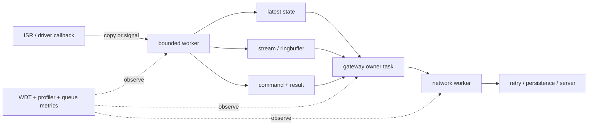

# ESP32-C5 / ESP32-S3 开源项目学习手册

> 研究快照：2026-07-10。本文档来自对 GitHub 一手仓库的固定提交源码阅读，重点关注功能边界、任务调度、通信、资源所有权、可靠性和对 ESP-111 的可迁移价值。

## 1. 这份手册回答什么

这不是项目收藏列表，也不是把 README 重新翻译一遍。它试图回答五个更实用的问题：

1. ESP32-C5 与 ESP32-S3 的硬件差异，会怎样改变任务调度和系统边界？
2. 官方与成熟社区项目如何组织 callback、worker、queue、ringbuffer、event loop 和状态机？
3. 哪些实现是产品级模式，哪些只是 bring-up 示例，哪些甚至是值得避开的反例？
4. 背压、停止、重连、看门狗、PSRAM、持久化和 OTA 应怎样形成闭环？
5. 这些模式对 ESP-111 的 C5 sensing -> S3 gateway -> Server 架构有什么直接意义？

研究范围覆盖 30 个候选项目，并对其中至少 12 个固定提交做代码级深读。文档不修改任何固件、后端、前端或数据库，也不把“仓库提到芯片名”当作“芯片已受支持”。

## 2. 阅读导航

| 文档 | 内容 | 适合何时读 |
|------|------|------------|
| [项目索引](01-project-index.md) | 30 个候选、固定 SHA、许可、支持强度和阅读优先级 | 选仓库、找源码入口 |
| [ESP32-C5 专题](02-esp32-c5.md) | 单核 RISC-V、Wi-Fi 6/5 GHz、BLE、802.15.4、CSI、低功耗与外置 RCP | 设计 C5 终端或无线并存 |
| [ESP32-S3 专题](03-esp32-s3.md) | 双核、PSRAM、音频、视觉、HMI、网关与社区产品固件 | 设计 S3 网关、多媒体或 UI |
| [调度与可靠性模式](04-scheduling-reliability.md) | 任务拓扑、背压、所有权、停止、WDT、重连、持久化和 OTA 横向比较 | 做架构评审和故障注入 |
| [ESP-111 映射](05-esp111-mapping.md) | direct-borrow / experiment / do-not-copy 建议和实验清单 | 把研究转成项目决策 |
| [来源与复核](06-sources.md) | 深读快照、证据路径、许可证和验证边界 | 审计结论与后续更新 |

推荐阅读顺序：先读本页和调度模式，再按当前工作选择 C5 或 S3 专题，最后读 ESP-111 映射。若只想寻找代码范例，直接从项目索引进入固定 commit permalink。

## 3. 证据口径

| 等级 | 可以证明什么 | 不能证明什么 |
|------|--------------|--------------|
| A | 固定 commit 的源码、构建配置、target preset 或官方 API 直接证明 | 未执行的代码一定能在目标板稳定运行 |
| B | README/设计文档与源码结构相互印证 | 当前 commit 的 CI 一定为绿色 |
| C | issue、release note、注释或局部配置提供线索 | 可作为生产架构事实 |
| D | 搜索摘要或二手文章只用于发现候选 | 进入最终强结论 |

本手册采用以下表述规则：

- “支持 C5/S3”至少要有 target、板级配置、CI matrix 或源码条件分支之一；强支持最好有两类证据互证。
- “CI 覆盖”指仓库定义了 job/workflow，不代表本轮核验到该 SHA 的在线运行结果。
- “静态风险”指源码控制流可以推导出窗口，但本轮未做故障注入或真机复现。
- “项目参数”只描述该项目的选择，不自动升级为芯片或 ESP-IDF 的通用默认。
- 预编译库内部不可见时，只描述公开 API 合同，不用参考源码猜测当前二进制实现。

## 4. 先记住的硬件差异

| 维度 | ESP32-C5 | ESP32-S3 | 调度含义 |
|------|----------|----------|----------|
| CPU | 单核 RISC-V | 双核 Xtensa LX7 | C5 无法靠 affinity 隔离；S3 也不会自动把系统 task 分散到两核 |
| 无线 | 2.4/5 GHz Wi-Fi 6、BLE、802.15.4 | 2.4 GHz Wi-Fi、BLE，无原生 802.15.4 | C5 多协议共享射频/天线；能力并存不等于可同时满载 |
| 典型角色 | sensing、无线终端、Thread/Zigbee 设备 | 网关、音频/视觉/HMI、USB、高 PSRAM 应用 | C5 重视 bounded work；S3 重视核预算、PSRAM 延迟与多 pipeline 协同 |
| 默认 event loop | `sys_evt` 在 core 0 | `sys_evt` 仍在 core 0 | S3 双核不改变同一 event loop 上 handler 串行的事实 |
| `tskNO_AFFINITY` | 实际只能在 core 0 | 可在两核间调度 | C5 的“不绑核”不是隔离；S3 的“不绑核”也不是确定性分配 |

最容易犯的错误，是把芯片能力表直接转成系统架构。例如 C5 同时拥有 Wi-Fi 和 802.15.4，但 `esp-thread-br` 明确指出单天线使 Wi-Fi 与 native Thread 不能同时接收，因此产品化 Border Router 推荐 C5 只做 Wi-Fi 主处理器、外接 H2 RCP。类似地，S3 有双核并不意味着默认 `sys_evt`、Wi-Fi 和应用任务已经自动隔离。

## 5. 跨项目得到的核心结论

### 5.1 callback 和系统 handler 只做有界工作

`esp-csi` 的较好样例把 CSI 数据复制后零等待投递，格式化/打印交给 worker；反例则直接在 callback 打整帧或忽略 pointer queue send failure。`esp-idf` 的 event loop 源码进一步说明，同一 loop 上的 handler 是串行的，任何长 handler 都会阻塞后续 Wi-Fi、IP 和业务事件。

生产门槛不是“用了 queue”就结束，而是同时具备：

- callback 不阻塞、不做网络、不打印大帧；
- allocation 失败可处理；
- queue-full 返回值必检查；
- pointer 的失败路径释放明确；
- drop、depth、latency 和 high-water 可观察。

### 5.2 状态流、命令流和数据流需要不同合同

| 流类型 | 推荐合同 | 代表项目 |
|--------|----------|----------|
| 最新状态 | depth-1 overwrite、coalescing、带 timestamp | SmartKnob、ESP-WHO |
| 连续数据 | ringbuffer/stream，明确 EOF、abort、timeout | ESP-ADF、esp-sr |
| 命令/控制 | 有限等待、ACK、retry budget、幂等 id | Matter、网关控制面 |
| 系统事件 | 短 handler，投递给预创建 worker | ESP-IDF、ESP-111 |
| 持久化 checkpoint | fixed/sliding window 合并，失败计数和重试 | esp-matter |

用一个 queue 同时承载状态、音频、命令和故障事件，通常会让背压语义互相冲突。状态应该丢旧保新，音频需要受控连续性，命令可能要求确认，故障事件需要独立保留或升级。

### 5.3 所有权比 queue API 更重要

跨项目最稳定的判断问题不是“用 `xQueueSend` 还是 `std::deque`”，而是：

> send 成功、send 失败、覆盖旧值、超时、取消、consumer 崩溃和系统 stop 时，谁释放 payload？

可靠模式包括按值复制、`unique_ptr` move、单一 `release()`、RAII binding 和明确 buffer lease。风险模式包括裸 pointer queue 忽略返回值、borrowed library result 跨任务保存、camera framebuffer 只靠 ring 深度延迟归还，以及无容量的结果队列。

### 5.4 stop 是一条独立协议

成熟 stop 路径通常遵循：

```text
close admission
  -> request cancellation
  -> wake every blocked reader/writer
  -> bounded wait / join
  -> release payload and peripheral buffers
  -> destroy worker-owned resources
  -> publish STOPPED result
```

ESP-ADF 的 `rb_abort()`、EOF 和 element state bits 是较完整样例。反面包括 esp-sr 文档中 fetch task 单方面销毁仍被 feed task 使用的 AFE、ESP-WHO 对 camera task 的无限 stop wait，以及 Xiaozhi AudioService 只置 stop flag、未 join 就允许重新 start。

### 5.5 重连和重启必须有持久预算

即时 `esp_wifi_connect()`、one-shot timer、无限 DNS event wait 和失败即 reboot 都能让 demo 快速工作，但不能处理长时间认证错误、断网、坏凭据和外设损坏。产品级恢复至少需要：

- 按 reason 分类；
- bounded exponential backoff + jitter；
- 新凭据/人工命令可以中断等待；
- attempt budget 跨 reboot 持久化；
- 达到上限进入 degraded/safe mode；
- recovery path 本身有指标和故障注入。

### 5.6 观测面要和调度一起设计

`esp-idf` 的 Task WDT named user 可以区分“task 仍活着”和“task 内某阶段不前进”；Brookesia 同时提供 scheduler statistics 与两点采样的 task profiler；ESP-WHO 的 `Yield2Idle` 展示了有损自恢复的代价。可观测项应至少包括：

- task stack high-water、CPU/core、最长单轮；
- queue depth/high-water/drop/block time；
- callback/handler latency；
- stream underrun/overrun、abort/timeout；
- reconnect attempt/backoff/reason；
- WDT task 与 phase user；
- heap internal/PSRAM largest block，而不仅是 total free。

## 6. 项目之间的任务拓扑



不同项目只是对这张图取了不同切面：

- ESP-IDF 给出 event loop、queue、WDT 和 task API 的基础合同；
- esp-csi 展示高频 callback 到 worker 的正反例；
- ADF/SR/WHO 展示音频与视觉数据面；
- Matter/Brookesia 展示串行 ownership、服务调用和生命周期；
- IoT Bridge/Thread BR 展示多网络接口、重连和外设协处理器恢复；
- SmartKnob/Xiaozhi 展示社区产品对 latest state、状态机和有界队列的取舍。

## 7. 如何把示例参数用于自己的系统

不要直接复制 priority、stack、queue depth 或 core id。更稳妥的使用顺序是：

1. 先复制语义：谁拥有状态、哪些流可丢、哪些命令要确认、stop 如何唤醒。
2. 再列出隐藏 task：`sys_evt`、Wi-Fi、timer、HTTP、OpenThread、LVGL、codec 和第三方组件。
3. 用保守参数跑真实 workload，记录 CPU、stack、queue 和延迟。
4. 做队列饱和、网络断开、坏凭据、内存失败、慢 consumer 和 stop 中断实验。
5. 最后调整 affinity、priority、stack、PSRAM placement 和 retry 参数。

源码中的数字是测量起点，不是答案。尤其是 C5 单核和 S3 core-0 系统事件负载，必须以整机 profile 为准。

## 8. 本轮未证明的内容

- 未在本轮构建这些外部仓库，也未核验所有固定 SHA 的在线 CI 绿色状态。
- 未对 C5/S3 做烧录、功耗、射频共存、FPS、声学、heap 或延迟测量。
- 未执行 queue saturation、allocation failure、断电、坏网络、RCP 损坏或 stop race 故障注入。
- 预编译 Matter/Thread/AFE/模型库内部行为只按公开接口描述。
- 对 ESP-111 的建议是源码级映射，不等同于已通过真机闭环。

这些限制不是文档缺陷的遮掩，而是后续实验设计的边界。静态阅读可以发现 ownership、无限等待和生命周期窗口，却不能替代硬件上的时序、功耗和射频证据。

