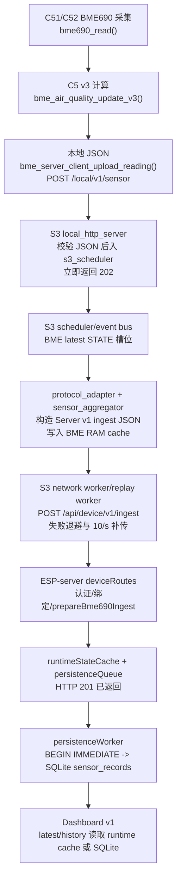

# ESP-111 数据上传链路代码审计

审计日期：2026-07-11  
审计范围：`ESPC51`、`ESPC52`、`ESPS3`、`ESP-server`  
审计方式：只读源码追踪；未编译、未烧录、未启动服务、未安装依赖、未执行 Git 操作。

## 结论摘要

当前代码中的正式路径确实是 **C5 -> ESPS3 -> ESP-server**，C5 没有直接调用 Server 的 `/api/*` 接口；C51/C52 的 BME 实现对称，ESPS3 也具备 BME RAM 缓存、上云重试和补传 worker。

但这条链路目前不能满足“完整保留 BME690 v3 数据、按采集时间连续记录、Server 成功即已持久化”的要求。存在 6 个 P1 风险：v3 字段在 C5->S3 边界丢失、绝对采集时间与 time-sync 信息丢失、Server 在 SQLite 提交前就返回成功、重试没有幂等去重、补传数据会被当作最新实时数据、BME 写入队列无上限。没有发现能证明整条链路完全不可用的 P0。

## 当前实际链路



| 步骤 | 当前实现 | 核心数据 | 结论与风险 |
| --- | --- | --- | --- |
| C5 采集 | `ESPC51/ESPC52/components/Middlewares/sensor_domain/bme690/service/bme_sensor_service.c:bme_sensor_service_tick()` | `bme690_data_t` | 正常。读取、计算、上传都在 BME worker，不阻塞调度器。 |
| C5 v3 计算 | `.../bme_air_quality.c:bme_air_quality_update_v3()` | `bme_air_quality_result_t.air_quality` | 计算出 `algorithm/score/level/confidence/gas_ratio/stability_score/sensor_state/baseline_ready`。 |
| C5 载荷 | `.../bme690/server_client/bme_server_client.c:bme_server_client_upload_reading()` | local schema v2，`id/t/pt/sk/u/q/ts/rid/values` 与平铺 BME 字段 | P1：没有序列化 `air_quality` 嵌套 v3 对象，也没有 JSON 内绝对 Unix 采集时间。 |
| C5 传输 | `.../server_comm/server_comm_http.c:server_comm_perform()` | `POST /local/v1/sensor` | 正常：SDK 根据 `esp_http_client_set_post_field()` 生成 Content-Length；5 秒超时；非 2xx 失败；close/cleanup 和 URL heap 释放完整。 |
| S3 接收 | `ESPS3/.../local_http_server.c:status_or_sensor_handler()` | body copy -> `s3_runtime_ingress_t` | 正常：先解析/allowlist，再入队，成功返回 202。该 202 只表示 S3 已接收并入 scheduler，不表示已缓存或已上云。 |
| S3 调度 | `.../runtime/s3_scheduler.c:state_key_for_ingress()`；`s3_event_bus.c:s3_event_bus_push_owned()` | `S3_EVENT_BUS_STATE_BME_LATEST_C51/C52` | P2：同 C5 的未消费 BME 会 latest-only 合并，旧值在进入 BME cache 前已释放。 |
| S3 转换/缓存 | `.../protocol_adapter.c`；`sensor_aggregator.c:sensor_aggregator_handle_envelope()`；`bme_cache_manager.c` | Server v1 envelope + exact JSON copy | 正常的缓存顺序是先 cache 后实时上传；P1/P2：时间和 v3 字段已在此之前丢失，缓存仅为 100 条 RAM 环。 |
| S3 上云 | `.../network_worker.c`；`network_replay_worker.c`；`server_client.c` | `/api/device/v1/ingest` | 正常：初次 + 4 次退避重试（2/5/10/30 s），HTTP 通道有 slot 控制，补传 10 条/秒。P1：无幂等键。 |
| Server 接收 | `ESP-server/src/routes/deviceRoutes.js` | schema v1、`payload_type=sensor.bme690` | 正常：gateway middleware、绑定后覆盖可信 `gateway_id/device_id`，仅接收 BME 类型。 |
| Server 存储/读取 | `sensorBme690Service.js`、`persistenceWorker.js`、`dashboardService.js` | `sensor_records`、`air_quality_json` | SQLite 写法本身有事务/WAL；P1：201 在入内存队列后返回，尚未提交 SQLite。 |

## C5 审计结果

### ESPC51 / ESPC52 一致性与身份

- `diff -qr` 确认两端 `sensor_domain/bme690/` 目录一致。
- 差异只在 `terminal_config.h` 的编译期身份：C51 为 `sensair_shuttle_01` / local id 1，C52 为 `sensair_shuttle_02` / local id 2。S3 的 `protocol_adapter_local_device_id_to_device_id()` 用同一映射恢复完整设备 ID。
- C5 本地 HTTP header 带 `X-Device-Id`、`X-Gateway-Id`、`X-Request-Seq`、`X-Esp-Uptime-Ms`；时间同步时还带 `X-Esp-Time-Ms`。这在 C5->S3 请求本身是正确的。

### 采集、周期、缓存与重试

- 默认 BME 周期为 5000 ms：`bme_sensor_service.h:BME_SENSOR_READ_UPLOAD_PERIOD_MS` 与 `terminal_config.h:TERMINAL_CONFIG_DEFAULT_UPLOAD_PERIOD_MS`。
- 实际周期优先读取 NVS `terminal_cfg/upload_ms`：`terminal_config.c:terminal_config_load()`，仅检查 `> 0`，没有最小/最大值限制。错误配置为极小值会压垮 BME worker 或网络。P2。
- `bme_sensor_service_tick()` 在 `c5_should_run(C5_TASK_TYPE_BME_SENSOR)` 失败时直接跳过；网关不 ready、voice busy 或 CPU/队列压力时不会采样，更不会保存待补传样本。P2。
- C5 没有 BME RAM/Flash 离线缓存，也没有同一条样本的 HTTP 重试。失败后只在下一轮重新采样。C5 Wi-Fi 重连有 1-3 秒退避，但这不等于 BME 数据可靠补传。P2。
- BME worker 队列长度仅 6：`c5_runtime_workers.h:C5_WORKER_QUEUE_LENGTH`。单次 BME HTTP 可阻塞到 5 秒，满队列时 `c5_worker_enqueue()` 直接丢 event，只累计通用 `drop_count`，没有 BME 专用丢弃计数。P2。
- 内存所有权正常：C5 JSON 为 1024 字节栈 buffer；HTTP 层的 URL heap buffer、client 均在每次请求 close/cleanup/free。`snprintf` 溢出返回失败，不会发送截断 JSON。

### C5 v3 字段完整性：P1

`bme_air_quality_result_t` 明确定义了 v3 嵌套结构，但 `bme_server_client_upload_reading()` 只写入：

```text
gas_baseline_ohm, gas_ratio, gas_score, humidity_score,
air_quality_score, air_quality_level, air_quality_confidence,
sample_count, algorithm_version, air_quality_algo_version
```

缺失的已计算字段为：

```text
air_quality.algorithm
air_quality.score
air_quality.level
air_quality.confidence       # 原始 0..1 数值
air_quality.stability_score
air_quality.sensor_state
air_quality.baseline_ready   # 仅有平铺 flags / baseline_ready 语义
```

因此 C5 的 v3 计算存在，但完整 v3 数据结构并不在 C5->S3 wire contract 中。S3 不会重新计算这些值，无法恢复。

### C5 时间戳：P1

- C5 把本地 `u` 写为 uptime、`ts` 写为同步布尔值，却不把 `metadata.esp_time_ms` 写入 JSON body。
- `metadata.esp_time_ms` 仅放在 HTTP header；S3 local HTTP handler 解析 body，不把这个 header 纳入 `protocol_adapter_envelope_t`。
- 所以 S3 的 `protocol_adapter_parse_local_envelope()` 以 `u` 作为 `timestamp_ms` fallback。这是单调 uptime，不是 Unix epoch；设备重启会回退。

## ESPS3 网关审计结果

### 已确认正常

- `/local/v1/sensor` 由 `local_http_server` 提供，明确不暴露 Server `/api/*`；C5 不直连 Server。
- 本地 body 先执行 `protocol_adapter_parse_local_envelope()` 和 allowlist 校验，才交给 `s3_scheduler`。
- scheduler 的重业务不在 HTTP handler 执行；handler 复制 body 后释放原 buffer，worker 再解析，避免 local HTTP 长时间被上云阻塞。
- BME cache 使用 mutex，缓存完整的 Server JSON 副本；实时上云仅在 `NETWORK_WORKER_LINK_STABLE` 且 Server ready 后进行；2xx 才删 cache。
- `network_replay_worker` 对缓存按设备和 sequence 选择记录，并以 100 ms 间隔补传，约 10 条/秒。
- `server_client` 使用有界 HTTP slot，记录 active request，关闭/epoch 变化可取消请求；JSON 上云可重试，非 2xx 视为失败。

### S3->Server 契约

- endpoint 正确：`ESP111_PROTOCOL_SERVER_ROUTE_DEVICE_INGEST` 是 `/api/device/v1/ingest`。
- `protocol_adapter_build_server_ingest_json()` 生成 `schema_version: 1`、`payload_type: sensor.bme690`、受 local-id 映射约束的 `device_id`、S3 `gateway_id`、payload。
- Server 端的 schema 要求也为 numeric `1`，路径与字段名兼容。

### S3 时间信息丢失：P1

S3 的 `protocol_adapter_build_server_ingest_json()` 无条件写入 `time_synced:false`；`server_client:perform_json_once()` 也无条件写 `X-Time-Synced: false`。这覆盖了 C5 已同步的事实。

Server 随后将采集记录 `timestamp`、`server_recv_ms` 都写成收到请求的时间。补传时，旧样本的时间被改成恢复网络后的时间；`upload_delay_ms` 也恒为 `null`。这会造成：

- 时间序列不再表示 BME 实际采样时刻；
- C5 重启后 uptime 不能作为连续时间线；
- Dashboard history、latest、memory jobs 均按 Server 接收时间排序；
- 旧缓存补传可能在新实时样本之后显示为“最新”。

### S3 cache 和 event bus 的数据丢失边界：P2

- BME ingress 被放入 `S3_EVENT_BUS_LEVEL_STATE` 的 C51/C52 latest 槽；同键新事件会立即释放旧事件。此合并发生在 `sensor_aggregator_handle_envelope()` 的 BME cache 写入之前。
- 当前统计仅有通用 `coalesce_count`，没有 `bme_ingress_coalesce_count`，无法从日志区分 BME 历史被合并的数量。
- `BME_CACHE_MANAGER_CAPACITY` 固定为 100；满时 `bme_cache_manager_push_json()` 直接覆盖 `head`，不排除 `in_flight` 记录。以每设备 5 秒一条估算，双 C5 同时离线约 250 秒即可能开始丢最早记录。
- cache 是纯 RAM。ESPS3 重启、断电、OTA 重启会清空全部未上云 BME。

## ESP-server 接收、数据库与 Dashboard 审计结果

### 已确认正常

- `POST /api/device/v1/ingest` 的入口为 `deviceRoutes.js:createDeviceRouter()`；仅接受 `sensor.bme690`。
- `requireGatewayAuth()` 后再调用 `requireBoundDevice()`，服务端把 `trustedGatewayId`、`trustedDeviceId` 写入 metadata，避免直接信任 payload 的设备身份。
- `prepareBme690Ingest()` 校验四个物理读数：温度、湿度、气压、气阻。
- 已传入的 legacy BME 质量字段会保存为拆分列和 `air_quality_json`；完整原始上云 envelope 也写入 `raw_json`。
- 旧版 fallback 不会覆盖一个合法的 legacy 空气质量值：`normalizeLegacyAirQuality()` 成功时来源仍是 `esp`，只有无效/缺失字段才计算 `server_fallback`。
- `persistenceWorker` 单 worker batch 使用 `BEGIN IMMEDIATE` / `COMMIT`；SQLite 配置 WAL、`synchronous=NORMAL`、`busy_timeout=5000`。单进程内的 SQLite 写入没有发现裸并发事务竞争。
- Dashboard latest/history 读取 `sensor_records` 并解析 `air_quality_json`，能展示当前实际已传输的分数、等级、置信度、gas ratio、baseline 状态等字段。

### Server 对 v3 的实际结果：P1

`normalizeV3AirQuality()` 只接受 `payload.air_quality` 嵌套对象且要求 `stability_score`、`sensor_state`。由于 C5/S3 当前没有传这个对象，Server 必走 `normalizeLegacyAirQuality()`。

所以目前：

- 已传的平铺 v2/v3 兼容字段会保存；
- `stability_score` 与 `sensor_state` 不会保存到 `air_quality_json`，Dashboard 读取时为 `null`；
- 这不是 Server fallback 覆盖了新值，而是新值从未到达 Server。

### 成功响应早于持久化：P1

`deviceRoutes.js` 的顺序为：

1. `runtimeCache.updateBmeSensor()`；
2. `enqueuePersistenceJob()`；
3. 返回 HTTP `201`；
4. 后台 `persistenceWorker` 之后才执行 SQLite transaction。

ESPS3 把任意 2xx 当作成功并删除对应 BME cache record。若 Server 在 201 后、SQLite commit 前崩溃，C5/S3 都认为该条数据已成功，样本不可恢复。这是当前端到端最直接的确认丢数窗口。

### 高并发、重试和重复：P1

- S3 上云在连接/超时/5xx 情况下会重试同一 JSON；补传也会再次投递直到收到 2xx。
- `sensor_records` 没有 `(device_id, request_seq, payload_type)` 唯一约束，也没有 idempotency key 检查。网络发生“Server 已处理但响应丢失”时，会写出重复记录。
- Server 的 `persistenceQueue` 仅对 CSI 设置了 1000 条特殊上限；BME 使用的 medium queue 无总量上限。持续快速请求或 SQLite 变慢时会持续占用 Node 堆，最终可能导致进程内存耗尽并扩大上述确认丢数窗口。
- runtime cache 在收到 HTTP 请求时立即按 `serverRecvMs` 覆盖最新 BME，且不比较采集时间/sequence。缓存补传与新样本并发时，较旧样本可覆盖实时卡片；SQLite latest query 同样按 `server_recv_ms` 排序，问题会持续到后续新采样。

### 认证配置风险：P3

若 `GATEWAY_AUTH_TOKEN(S)` 未配置，`authenticateGateway()` 明确允许声明式 gateway 身份。该行为不直接破坏当前 C5->S3 路径，但部署到不可信网络时，任意客户端可声明 gateway/device 并创建绑定。生产环境应强制配置 token 并拒绝空 secret。

## 潜在 Bug 与风险清单

| 等级 | 位置 | 问题 | 影响 |
| --- | --- | --- | --- |
| P1 | C5 BME JSON -> S3 adapter -> Server service | v3 nested `air_quality` 未传输 | `stability_score`、`sensor_state`、原始数值 confidence 等永久丢失，Server 退回 legacy 解析。 |
| P1 | C5 metadata / S3 protocol adapter / server client | C5 epoch 时间只在 local HTTP header，S3 固定 false time-sync | 历史按上云到达时间而非采集时间；无法计算真实上传延迟；重启/补传时间不连续。 |
| P1 | Server route -> persistence queue -> S3 cache deletion | Server 在 SQLite commit 前返回 201 | Server 崩溃窗口内，S3 已删缓存，发生确认后丢数。 |
| P1 | S3 retry/replay -> Server `sensor_records` | 无幂等键/唯一约束 | 响应丢失后的重试可写入重复 BME 记录。 |
| P1 | Server runtime cache / latest query | 重放旧样本使用新的 server receive time | 补传期间旧样本可能覆盖最新实时状态和 Dashboard latest。 |
| P1 | Server `persistenceQueue` | BME 队列无容量上限 | 高并发或 SQLite 变慢时存在 Node 内存失控和后续丢数风险。 |
| P2 | C5 BME service | S3 不可用时跳过采样，无缓存 | C5->S3 断链期间的样本不可补传。 |
| P2 | C5 event/worker queue | 队列长度 6，上传可能 5 秒阻塞 | 负载下 BME tick 可被直接丢弃，统计粒度不足。 |
| P2 | S3 event bus | BME 使用 latest-only state slot，cache 前可合并 | S3 压力下已获 202 的历史 BME 可不进入 cache。 |
| P2 | S3 BME RAM cache | 100 条、覆盖 oldest、重启丢失 | 长离线、双设备上报、或 ESPS3 重启会丢缓存数据。 |
| P2 | C5 NVS upload period | 仅校验 `upload_ms > 0` | 过小配置可制造过采样、队列压力与丢弃。 |
| P3 | ESP-server auth | 未配置 token 时 fail-open | 非可信网络存在伪造上报/绑定风险。 |

## 推荐优化顺序

1. **先修 P1 数据契约。** 在 C5 BME JSON 中加入完整 `air_quality` v3 对象和 `esp_time_ms`；S3 解析、缓存、Server envelope 必须原样转发 `time_synced`、epoch sample time、uptime 和 request sequence。保留 `sample_time_ms` 与 `server_recv_ms` 两个不同字段。
2. **把 Server 的成功语义改为“已持久化”。** 对 ingest 同步完成 SQLite transaction 后才返回可删除缓存的成功，或设计持久化 inbox/outbox 并返回可证明落盘的 receipt。S3 仅在该 receipt 对应成功后删除 BME cache。
3. **实现幂等。** 增加稳定 `boot_id + request_seq` 或 UUID；Server 对 `(gateway_id, device_id, payload_type, boot_id, request_seq)` 建唯一约束并返回同一 receipt。不能只用 C5 sequence，因为它会在 reboot 后归零。
4. **修正 replay 排序。** Dashboard latest 必须按有效 `sample_time_ms`（并带 sequence/boot-id）选最新；补传只补历史，不得用接收时间覆盖当前实时状态。
5. **明确缓存策略。** 若目标是完整历史，BME 不应在 S3 event bus 使用 latest-only；将 BME 与 CSI/snapshot 的合并策略分离。cache 满时应有显式拒绝/降采样/持久 Flash spool 策略，不能无声覆盖 in-flight 或 oldest。C5 至少保留有限的 latest/pending 样本并为断链定义覆盖策略。
6. **给队列加入背压。** Server BME persistence queue 设置上限、队列深度指标和可重试的 429/503；C5 NVS 上报周期设置可接受范围；分别记录 C5 BME drop、S3 BME coalesce/cache overwrite、Server BME queue reject、重复命中和持久化确认延迟。
7. **生产安全收口。** 强制 gateway token，禁止空 secret 下的声明式认证。

## 建议的验收证据

- 断开 ESPS3 的 STA，持续采集超过缓存上限，再恢复网络；逐条比对 C5 sample sequence、S3 cache sequence、SQLite record 与丢弃计数。
- 在 Server 收到 ingest 且 SQLite commit 前注入进程终止，确认 S3 不删除可重放样本。
- 模拟“Server 已 commit、响应丢失”，确认同一 idempotency key 只产生一行数据。
- 让 C5 同步时间后发送 v3，断言 Server `air_quality_json` 中完整保存 `stability_score`、`sensor_state`、数值 confidence、baseline 状态以及 `sample_time_ms`。
- 同时发送新样本和旧缓存补传，确认 Dashboard latest 保持最新采样值，history 仍按采样时间连续。

## 审计限制

本报告是当前源码的静态结论。HTTP/SDK 的实际 Content-Length 由 `esp_http_client_set_post_field()` 生成，代码路径正确，但未在设备上抓包验证。硬件传感器读数、NVS 实际配置、Server 环境变量、断电恢复和真实并发容量均未在本次只读审计中执行验证。
